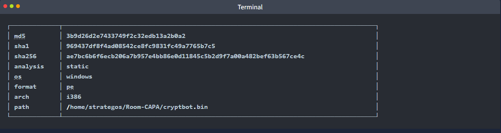
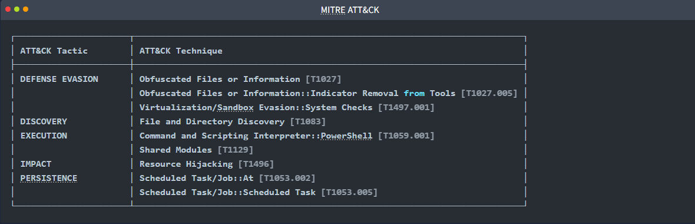
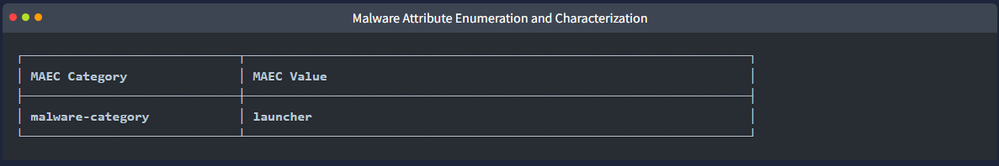
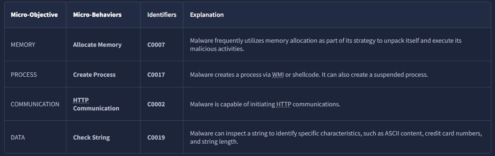
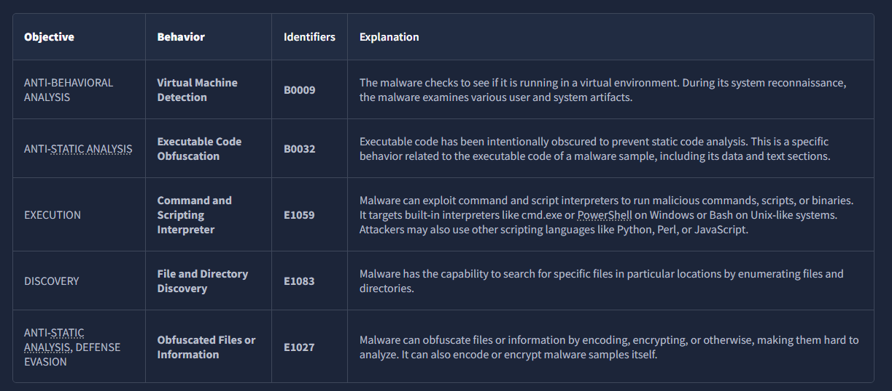
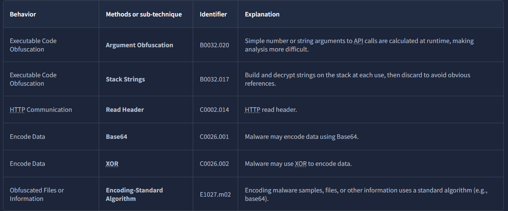
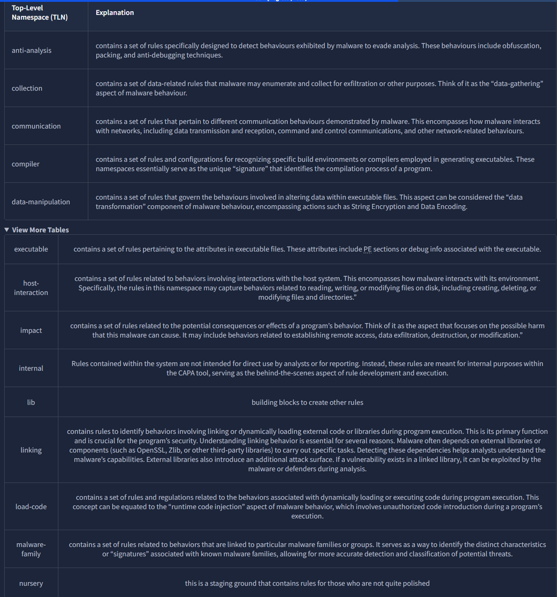
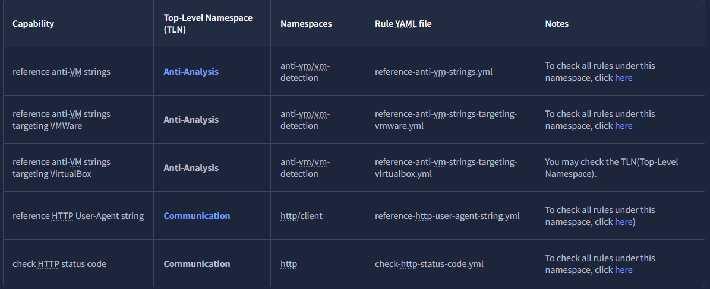
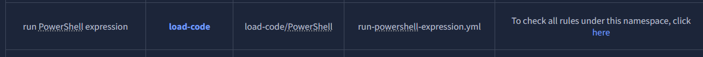
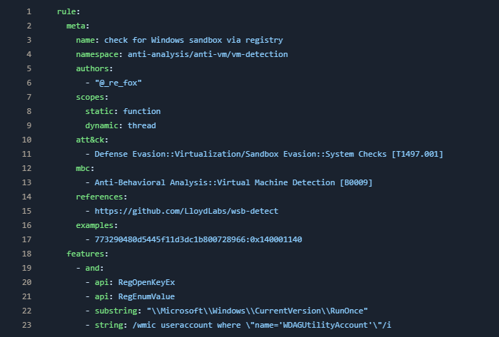

**Task 2 - How CAPA Works**

*Q1: What command-line option would you use if you need to check what other parameters you can use with the tool? Use the shortest format.*

A: **-h** is the short form flag for the **help** command. This would be what we use to check what other parameters can be used with the tool.

*Q2: What command-line options are used to find detailed information on the malware's capabilities? Use the shortest format.*

A: **-v** or **verbose** instructs the command line to be more specific and detailed with its information provided.

*Q3: What command-line options do you use to find very verbose information about the malware's capabilities? Use the shortest format.*

A: **-vv or Very Verbose** dives even deeper into the specifics and will provide even more information than a regular -v command would.

*Q4: What PowerShell command will you use to read the content of a file?*

A: The PowerShell command **Get-Content** will allow us to read the content of a file.

**Task 3 - Dissecting CAPA Results Part 1: General Information, MITRE and MAEC**

As mentioned in the previous task, the results of running CAPA against cryptbot.bin  will be discussed in the succeeding task. As such, we will dissect the results per block and topic.

*Q1: What is the SHA256 of cryptbot.bin?*

A: Looking at our results, we can see that the SHA256 of cryptbot.bin is **ae7bc6b6f6ecb206a7b957e4bb86e0d11845c5b2d9f7a00a482bef63b567ce4c**.

*Q2: What is the **Technique** identifier of **Obfuscated Files or Information**?*

A: Further looking at our results, let's pay attention to our ATT&CK Tactic section. It will be displayed below.

As seen in the image, our identifier is **T1027**.

*Q3: What is the **Sub-Technique** identifier of **Obfuscated Files** or **Information::Indicator Removal** from tools?*

A: Looking deeper into the image seen above, we can see there is a sub-technique identifier. We can see that it is **T1027.005**.

*Q4: When CAPA tags a file with this MAEC value, it indicates that it demonstrates behaviour similar to, but not limited to, **Activating persistence mechanisms**?*

A: MAEC, or **Malware Attribute Enumeration and Characterization** will classify malware based on its attributes. In our case, it is attributed as a **Launcher** in the *malware-category* section. It can be seen below.

*Q5: When CAPA tags a file with this MAEC value, it indicates that the file demonstrates behavior similar to, but not limited to, **Fetching additional payloads or resources from the internet**?

A: Let's reference the table provided to us in the task. According to the table, MAEC would classify the description in the question as a **Downloader**.

**Task 4 - Dissecting CAPA Results Part 2: Malware Behavior Catalogue**

*Q1: What serves as a catalogue of malware objectives and behaviors?*

A: The **MBC or Malware Behavior Catalogue**, servers as a catalogue of malware objectives, as well as behaviors.

*Q2: Which field is based on ATT&CK tactics in the context of malware behavior?*

A: The **Objective** field is based on ATT&CK tactics within the context of malware and its behavior.

*Q3: What is the Identified of **"Create Process"** micro-behavior?*

A: Referencing the table provided, we can see that the "Create Process" micro-behavior is identified by **C0017**.

*Q4: What is the behavior with an identifier of **B0009**?*

A: To view the table, we need to hit the view more tables option in tryhackme. Once done, we can see the table where the behavior with identifier "B0009" is. The behavior is **Virtual Machine Detection**.

*Q5: Malware can be used to obfuscate data using base64 and XOR. What is the related **micro-behavior** for this?*

A: The **Encode Data** micro-behavior is used to obfuscate data using base64, and XOR. Which of these is used is identified by the sub-technique identifier.

*Q6: Which micro-behavior refers to **"Malware is capable of initiating HTTP communications"**?*

A: As seen in the table above with the previous question, we can see that the **HTTP Communication** micro-behavior is associate with initiating said communications.

**Task 5 - Dissecting CAPA Results Part 3: Namespaces**

*Q1: Which top-level Namespace contains a set of rules specifically designed to detect behaviors, including obfuscation, packing, and anti-debugging techniques **exhibited by malware to evade analysis**?*

A: The **Anti-Analysis** TLN or top-level namespace contains a set of rules specifically designed to detect behaviors in order for malware to evade analysis.

*Q2: Which namespace contains rules to **detect virtual machine (VM) environments**? Note that this is not the TLN or Top-Level Namespace.*

A: The **anti-vm/vm-detection** namespace contains rules to detect VM environments.

*Q3: Which Top-Level Namespace contains rules related to **behaviors associated with maintaining access or persistence within a compromised system**? This namespace is focused on understanding how malware can establish and maintain a presence within a compromised environment, allowing it to persist and carry out malicious activities over an extended period.*

A: The **Persistence** namespace as the name implies, contains rules related to maintaining access or persistence within a compromised system.

*Q4: Which namespace addresses techniques such as **String Encryption, Code Obfuscation, Packing, and Anti-Debugging Tricks**, which conceal or obscure the true purpose of the code?*

A: The **Obfuscation** namespace addresses techniques such as string encryption which intent to conceal or obscure the true purpose of certain code.

*Q5: Which Top-Level Namespace is a **Staging Ground** for rules that are not quite polished?*

A:  The **Nursery** TLN is a staging ground for rules that need some refinement, or are not quite polished.

**Task 6 - Dissecting CAPA Results Part 4: Capability**

*Q1: What **rule yaml file** was matched if the capability or rule name is **check HTTP status code**?*

A: **check-http-status-code.yml** is the yaml file matched if the capability or rule name is check HTTP status code.

*Q2: What is the **name of the capability** if the rule YAML file is reference-anti-vm-strings.yml ?*

A: **Reference Anti-VM Strings** is the name of the capability of the rule YAML file.

*Q3: Which **TLN** or Top-Level Namespace includes the capability or rule name **run PowerShell expression**?*

A: The TLN that includes the capability run PowerShell expression is **Load-Code**.

*Q4: Check the conditions inside the check-for-windows-sandbox-via-registry.yml rule file from this  . What is the **Value of the API** that ends in Ex is it looking for?*

A: **RegOpenKeyEx** is the value of the API the check-for-windows-sandbox-via-registry.yml rule file is looking for. It can be seen on line 20 of the image below.

**Task 7 - More Information, more fun!**

*Q1: Which parameter allows you to output the result of CAPA into a **.json file**?*

A: The parameter **-j** allows us to output the results of CAPA into a .json file.

*Q2: What tool allows you to interactively explore CAPA results in your web browser?*

A: **CAPA Web Explorer** allows us to interactively explore CAPA results in our web browser.

*Q3: Which feature of this CAPA Web Explorer allows you to filter options or results?*

A: The **Global Search Box** feature of CAPA Web Explorer allows us to filter options or results found.

**Thanks for Reading!**