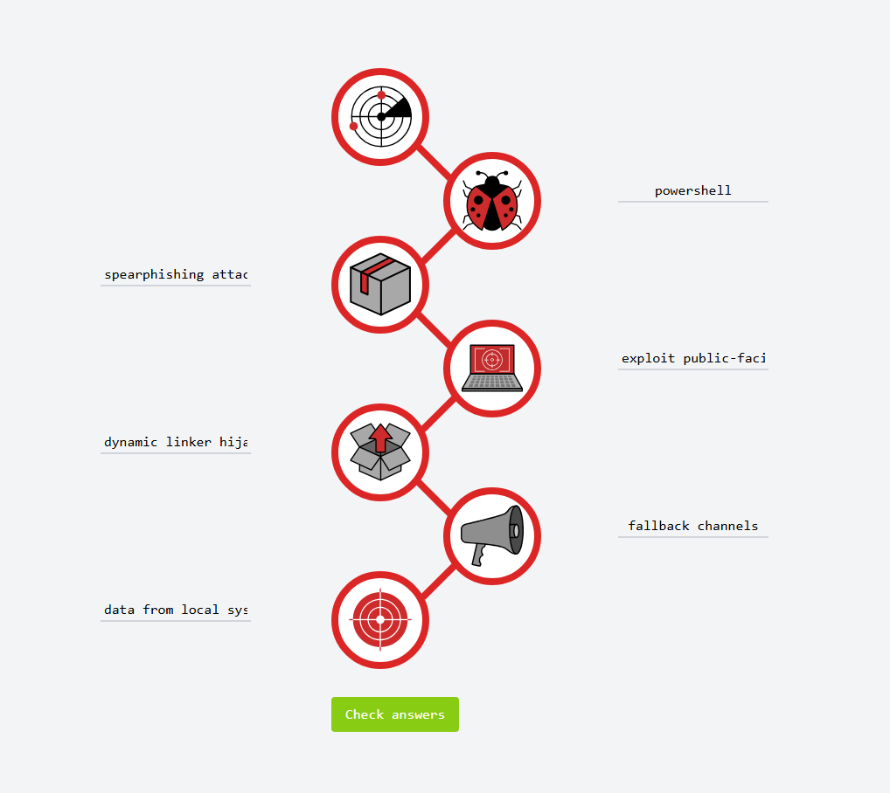

**Task 2 - Reconnaissance**

*Q1: What is the name of the Intel Gathering Tool that is a web-based interface to the common tools and resources for open-source intelligence?*

A: The **OSINT Framework** is the name of the Intel Gathering Tool that is web-based. It interfaces with common tools and resources for open-source intelligence.

*Q2: What is the definition for the email gathering process during the stage of reconnaissance?*

A: **Email Harvesting** is the gathering process for emails during the reconnaissance stage. It is the process of obtaining email addresses from public, paid, or free services.

**Task 3 - Weaponization**

*Q1: This term is referred to as a group of commands that perform a specific task. You can think of them as subroutines or functions that contain the code that most users use to automate routine tasks. But malicious actors tend to use them for malicious purposes and include them in Microsoft Office documents. Can you provide the term for it?*

A: The term the question is looking for is **Macro**. In this case, it can also be referred to as a VBA (Visual Basic Application) script.

**Task 4 - Delivery**

*Q1: What is the name of the attack when it is performed against a specific group of people, and the attacker seeks to infect the website that the mentioned group of people is constantly visiting?*

A: A **Watering Hole Attack** is the name of an attack that targets a specific group of people, and the attacker seeks to infect the website that the targeted group constantly and consistently visits.

**Task 5 - Exploitation**

*Q1: Can you provide the name for a cyberattack targeting a software vulnerability that is unknown to the antivirus or software vendors?*

A: The name for a cyberattack targeting a software vulnerability that is unknown to the antivirus or software vendors, and the cybersecurity world as a whole is known as a **Zero-day**.

**Task 6 - Installation**

*Q1: Can you provide the technique used to modify file time attributes to hide new or changes to existing files?*

A: **Timestomping** is a technique used to avoid detection and modify file time attributes to hide changes to existing files.

*Q2: Can you name the malicious script planted by an attacker on the webserver to maintain access to the compromised system and enables the webserver to be accessed remotely?*

A: A **Web Shell** is a malicious script planted by an attacker on a webserver to maintain access to a compromised system and enables it to be accessed remotely.

**Task 7 - Command & Control**

*Q1: What is the C2 communication where the victim makes regular DNS requests to a DNS server and domain which belong to an attacker?*

A: **DNS Tunneling** is the C2 communication where the victim makes regular DNS requests to a DNS server and domain which belong to the attacker.

**Task 8 - Actions on Objections (Exfiltration)**

*Q1: Can you provide a technology included in Microsoft Windows, that can create backup copies or snapshots of files or volumes on the computer, even when they are in use?*

A: **Shadow Copy** is a technology included in the Microsoft Windows operating system and can create backups or snapshots of files or volumes on a computer, even when they are in use.

**Task 9 - Practice Analysis**

*Q1: What is the flag after you complete the static site?*

A: 

**Thanks for Reading!**