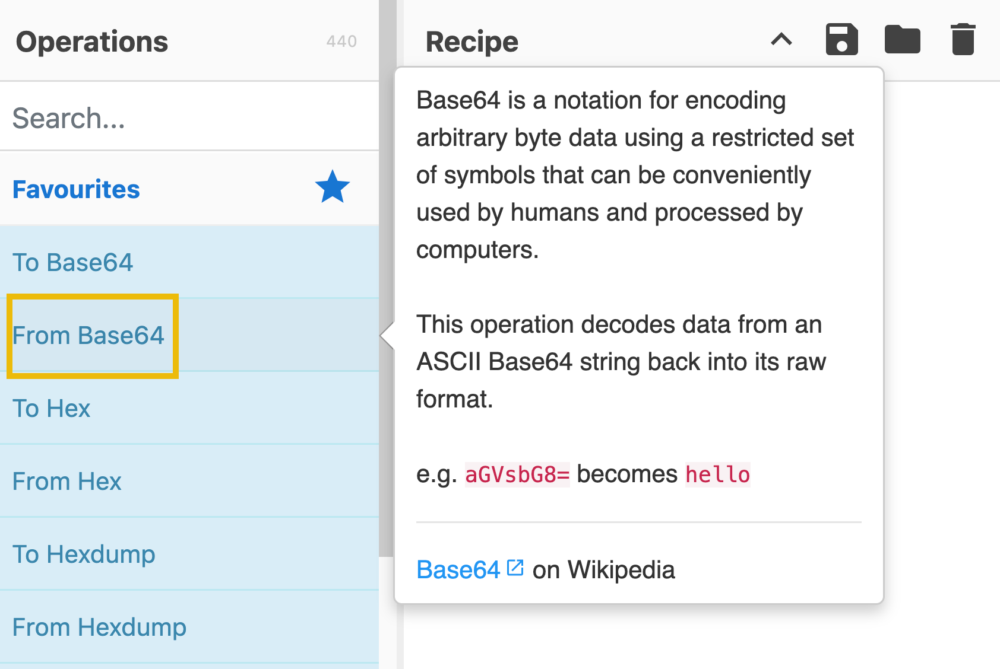

**Task 3 - Navigating the Interface**

*Q1: In which area can you find "From Base64"?*

A: The **Operations** area is where you can find "From Base64". It can be see below as a visual.

*Q2: Which area is considered the heart of the tool?*

A: The **Recipe** area is considered the heart of the tool. In the area, you can seamlessly select, arrange, and fine tune operations to suit specific needs.

**Task 4 - Before Anything Else**

*Q1: At which step would you determine, "What do I want to accomplish?"?*

A: **Step 1** would be the step where you would determine what exactly you want to accomplish through using CyberChef.

**Task 5 - Practice, Practice, Practice**

*Q1: What is the hidden email address?*

A: To begin the task, make sure you have the .txt file required to complete the practical exercise downloaded. From there, we will upload it in the top-left of CyberChef. Once uploaded, we will drag the *Extract email addresses* extractor to the recipe menu. This will give us our answer, which is **hidden@hotmail.com**.

*Q2: What is the hidden IP address that ends in .232?*

A: A similar process as the previous question. Drag out the email addresses recipe, and drag in the IP address extractor. We will have our output, which shows us two IP addresses, one of which ending in .232, which is our answer: **102.20.11.232**.

*Q3: Which domain address starts with the letter "T"?*

A: Once again, just refining the process here. Drag out the IP address extractor, and drag in the domain extractor. We will get two domains, one of which starts with the letter "T". Our answer is **tryhackme.com**.

*Q4: What is the binary value of the decimal number 78?*

A: This one requires us to combine operations to create a recipe in CyberChef. Firstly, we will get rid of our input file for the time being. Just delete the input text. Secondly, clear your operations, and then add the "From Decimal" operation. We also need to add the "To Binary" operation. In tandem, this will convert our desired decimal number, 78, to a binary value. Lastly, input 78 into the input section. This will output our answer in binary, **01001110**.

*Q5: What is the URL encoded value of https://tryhackme.com/r/careers?*

A: To encode our URL here, we need to add that operation. Drag the URL encoder operation over to the recipe. Then, check the box to encode all special characters. Please note that it will not encode otherwise. Lastly, input our URL as the input, and we should have our encoded URL: **https%3A%2F%2Ftryhackme%2Ecom%2Fr%2Fcareers** 

**Task 6 - Your First Official Cook**

*Q1: Using the file you downloaded in Task 5, which IP starts and ends with "10"?*

A: Looking back at the previous task, we saw 2 IP addresses. This is the same recipe. We can also reference our previous image, and see the IP address we are looking for this time is **10.10.2.10**.

*Q2: What is the base64 encoded value of the string "Nice Room!"?*

A: To accomplish this, we need to drag two operations to our recipe: **Strings and To Base64**. This will allow us to convert the string provided to us in the question to Base64. Then, we input our string in the input box. This will give us our answer: 

*Q3: What is the URL decoded value for https%3A%2F%2Ftryhackme%2Ecom%2Fr%2Froom%2Fcyberchefbasics?*

A: This answer is on the simpler side, as it only requires one operation, the URL decoder. Drag it over, and input our encoded URL provided. It will give us the following answer: **https://tryhackme.com/r/room/cyberchefbasics**.

*Q4: What is the datetime string for the Unix timestamp 1725151258?*

A: Like before, this answer only requires one operation, the "From UNIX Timestamp" operation. Drag it over, and input our given Unix timestamp. Our answer is **Sun 1 September 2024 00:40:58 UTC**. 

*Q5: What is the Base85 decoded string of the value <+oue+DGm>Ap%u7?*

A: In CyberChef, simply input our given value in Base85, and in the recipe, drag in the "From Base85" option. It should say **This is fun!** as the answer.

**Thanks for reading!**
