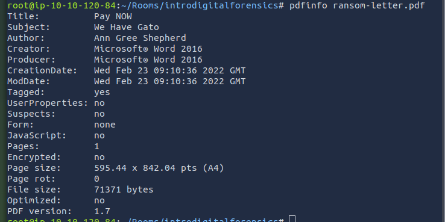
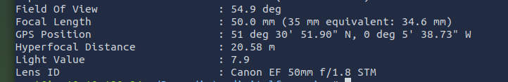
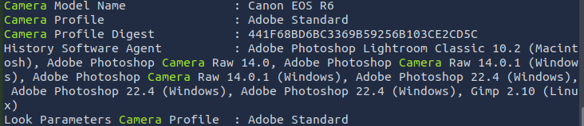

**Task 1 - Introduction to Digital Forensics**

*Q1: Which team was handed the case by law enforcement?*

A: The **Digital Forensics** team was handed the case by the law enforcement team. This is likely due to there being a USB drive found on the crime scene.

**Task 2 - Digital Forensics Methodology**

*Q1: Which phase of digital forensics is concerned with correlating the collected data to draw any conclusions from it?*

A: The **Analysis** phase of digital forensics is concerned with correlating the collected data and draw conclusions from said data. This is considered the step prior to the final one, which is reporting.

*Q2: Which phase of digital forensics is concerned with extracting the data of interest from the collected evidence?*

A: The **Examination** phase of digital forensics is concerned with extracting the necessary data of interest from the collected evidence from the crime scene.

**Task 3 - Evidence Acquisition**

*Q1: Which tool is used to ensure data integrity during the collection?*

A: A **Write Blocker** ensures data integrity during data collection. This is usually necessary to maintain the chain of custody, and integrity of data during a court case. A write blocker ensures that a user when collecting the data cannot modify the data.

*Q2: What is the name of the document that has all the details of the collected digital evidence?*

A: The **Chain of Custody** document has all details related to the collected digital evidence of a given case.

**Task 4 - Windows Forensics**

*Q1: Which type of forensic image is taken to collect the volatile data from the operating system?*

A: A **Memory Image** is taken to collect volatile data that is often overwritten from the operating system. This data can be critical to any given cyber investigation.

**Task 5 - Practical Example of Digital Forensics**

In this exercise, we are going to dive a bit deeper and hands on with some files that we are going to run commands on. 

*Q1: Using **pdfinfo**, find out the author of the attached PDF file, **ransom-letter.pdf**.*

A: Firstly, we need to navigate over to the file folder. A quick **cd** command will do this.
Secondly, we enter the **pdfinfo** command in, then the name of our file. In our case, **ransom-letter.pdf**.

We can see our answer above is **Ann Gree Shepherd**.

*Q2: Using **exiftool** or any similar tool, try to find where the kidnappers took the image they attached to their document. What is the name of the street?*

A: Once we run the **exiftool** command on the file associated with ransom-letter.pdf, (letter-image.jpg) we should come across some coordinates. Enter these into google maps, and we will have our answer: **Milk Street**

*Q3: What is the model name of the camera used to take this photo?*

A: To answer our final question, we can filter out some unnecesary results from **exiftool**. This can be done by running our command again, and then adding onto it with some pipes (the "|" key). We will then add **grep Camera** after the pipe, and it should only return lines that have Camera related to them. Our model should be the **Canon EOS R6**.

**Thanks for reading!**