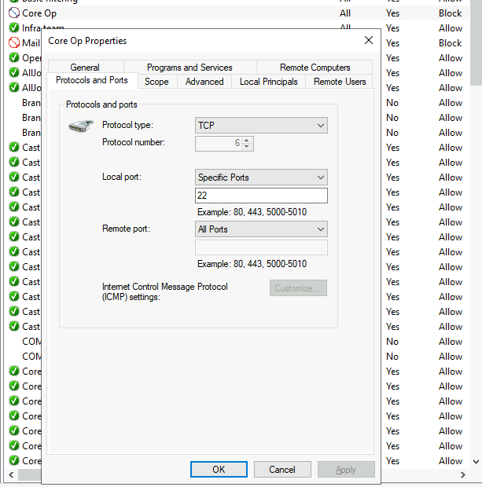
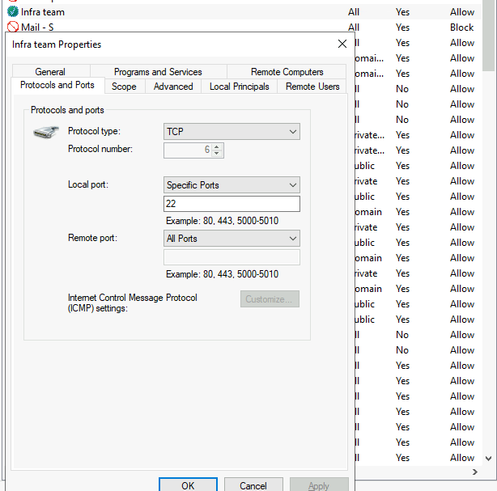
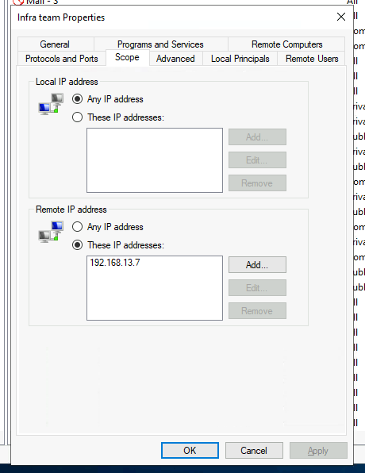

**Task 1 - What Is the Purpose of A Firewall?**

*Q1: Which security solution inspects the incoming and outgoing traffic of a device or a network?*

A: A **Firewall** inspects incoming, as well as outgoing traffic of a device or network.

**Task 2 - Types of Firewalls**

*Q1: Which type of firewall maintains the state of connections?*

A: A **Stateful Firewall** maintains the state of connections. It recognizes traffic through patterns and complex rules can be applied to them.

*Q2: Which type of firewall offers heuristic analysis for the traffic?*

A: **Next-generation Firewalls** offer heuristic analysis for incoming and outgoing traffic. They provide advanced threat protection, and comes with an **Intrusion Protection System (IPS)**. They will decrypt and inspect SSL and TLS data packets as well.

*Q3: Which type of firewall inspects the traffic coming to an application?*

A: A **Proxy Firewall** inspects data inside of packets incoming to an application. It provides content filtering, as well as application control mechanisms.

**Task 3 - Rules in Firewalls**

*Q1: Which type of action should be defined in a rule to permit any traffic?*

A: An **Allow** action should be defined in a rule to permit traffic.

*Q2: What is the direction of the rule that is created for the traffic leaving a network?*

A: **Outbound** traffic is the direction in which packets are leaving a network.

**Task 4 - Windows Defender Firewall**

### Exercise

The security team noticed suspicious incoming and outgoing traffic on their critical Windows system. They created rules on their Windows Defender Firewall to block some of their specific network traffic. You are tasked to answer a few questions given at the end of this task by looking at the created rules.

*Q1: What is the name of the rule that was created to block all incoming traffic on the SSH port?*

A: Loading into the Windows Defender Firewall settings, we can see a few block rules. Upon looking at the fire one called **Core Op**, we can see it is blocking all traffic on port 22, which is SSH.

*Q2: A rule was created to allow SSH from one single IP address. What is the rule name?*

A: Upon looking at a few rules near the top that are allow rules, we can see a rule called        **Infra Team**. Upon closer inspection, it is an allow rule which allows for traffic over port 22, which is again, SSH.

*Q3: Which IP address is allowed under this rule?*

A: Under the "Scope" tab of the properties for the rule, we can see that there is one remote IP address in particular that is on the allow list. This is IP is **192.168.13.7**. 

**Task 5 - Linux iptables Firewall**

*Q1: Which Linux firewall utility is considered to be the successor of "iptables"?*

A: **nftables**, or NetFiltertables, is considered to be the successor of iptables. It features enhanced packet filtering and NAT capabilities.

*Q2: What rule would you issue with ufw to deny all outgoing traffic from your machine as a default policy? (answer without sudo)*

A: Let's construct our command for a firewall rule. This begins with **ufw**. ufw stands for Uncomplicated Firewall. Secondly, we want this rule to be the default interaction, so we add a "default" after ufw. Thirdly, we want the actual rule to be a deny rule, so we add "deny". Lastly, it will be for outgoing traffic, so we add "outgoing" at the end. 

The final rule should look like this: **ufw default deny outgoing**.

**Thanks for reading!**
