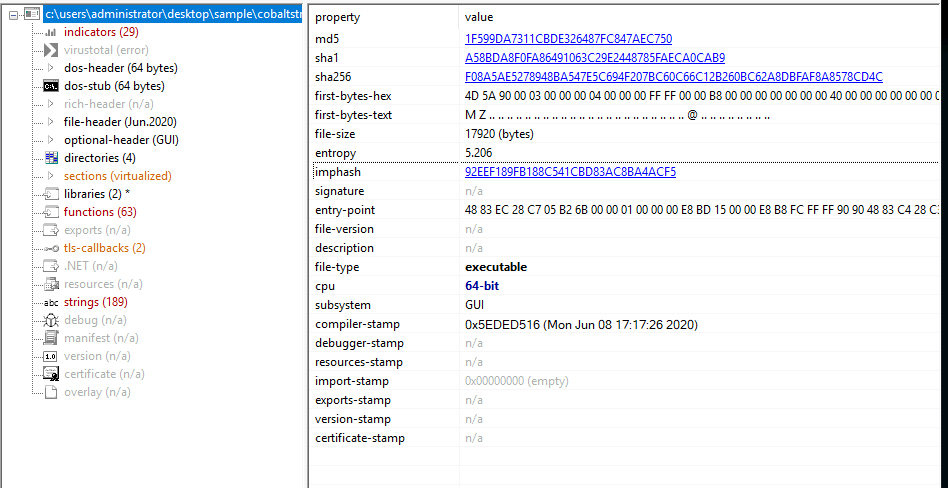

**Task 2 - Arsenal of Tools**

*Q1: Which tool is an Open-source debugger for binaries in x64 and x32 formats?*

A: **x64dbg**, short for **x64 Debugger** is an Open-source debugging tool for binaries in both x64 and x32 formats.

*Q2: What tool is designed to analyze and edit Portable Executable (PE) files?*

A: **CFF Explorer** is a PE editor designed to analyze as well as edit Portable Executable files.

*Q3: Which tool is considered a sophisticated memory editor and process watcher?*

A: **Process Hacker** is considered a sophisticated memory editor, and is a process watcher.

*Q4: Which tool is used for Disc image acquisition and analysis for forensic use?*

A: **FTK Imager** is a tool used for Disc imaging and acquisition for analysis during digital forensics.

*Q5: What tool can be used to view and edit a binary file?*

A: **HxD** is a tool used to view and edit binaries files with hexadecimal values.

**Task 3 - Commonly Used Tools for Investigation: Overview**

*Q1: Which tool was formerly known as FireEye Labs Obfuscated String Solver?*

A: **FLOSS** was former name of the tool now known as the FLARE Obfusctaed String Solver.

*Q2: Which tool offers in-depth insights into the active processes running on your computer?*

A: **Process Explorer** offers in-depth insight into active processes running on a machine.

*Q3: By using the Process Explorer (procexp) tool, under what process can we find smss.exe?*

A: By using procexp, we can see that smss.exe is running under the **System** process in Windows.

*Q4: Which powerful Windows tool is designed to help you record issues with your system's apps?*

A: **Procmon, or Process Monitor**, is a powerful Windows tool designed to help the user record issues regarding your system's apps.

*Q5: Which tool can be used for static analysis or studying executable file properties without running the file?*

A: **PEStudio** is a tool used for static analysis and studying executable file properties without actually running the executable file.

*Q6: Using the tool PEStudio to open the file cryptominer.bin in the Desktop\Sample folder, what is the sha256 value of the file?*

A: Once we run PEStudio, open the file cryptominer.bin, which is found in the Desktop\Sample folder. Once there, we can see the sha256 value is **E9627EBAAC562067759681DCEBA8DDE8D83B1D813AF8181948C549E342F67C0E**.

*Q7: Using the tool PEStudio to open the file cryptominer.bin in the Desktop\Sample folder, how many functions does it have?*

A: Upon further inspection of cryptominer.bin in PEStudio, we can see that the file has **102** different functions.

*Q8: What tool can generate file hashes for integrity verification, authenticate the source of system files, and validate their validity?*

A: The tool **CFF Explorer** can generate file hashes in order to verify integrity, authenticate the source of system files, as well as validate any validity.

*Q9: Using the tool CFF Explorer to open the file possible_medusa.txt in the Desktop\Sample folder, what is the MD5 of the file?*

A: Upon inspecting the file possible_medusa.txt in the Desktop\Sample folder, we can see that the MD5 hash of the file is **646698572AFBBF24F50EC5681FEB2DB7**.

*Q10: Use the CFF Explorer tool to open the file possible_medusa.txt in the Desktop\Sample folder. Then go to the DOS Header Section. What is the e_magic value of the file?*

A: **5A4D** is the e_magic value of the file. See the image below.

**Task 4 - Analyzing Malicious Files!**

*Q1: Using PEStudio, open the file windows.exe. What is the entropy value of the file windows.exe?*

A: Let's open the windows.exe file in PEStudio. Upon inspection, we can see that the value beside entropy is **7.999**.

*Q2: Using PEStudio, open the file windows.exe, then go to manifest (administrator section). What is the value under requestedExecutionLevel?*

A: Going down to the manifest (admistrator section), upon inspecting what appears to be an XML file, we can see that the value of requestedExecutionLevel is **requireAdministrator**.

*Q3: Which function allows the process to use the operating system's shell to execute other processes?*

A: **set_UseShellExecute** is the function that allows processes to use the operating system's shell in order to execute other processes.

*Q4: Which API starts with R and indicates that the executable uses cryptographic fundtions?*

A: **RijndaelManaged** is the name of the API that indicates that the executable is using cryptographic functions.

*Q5: What is the Imphash of cobaltstrike.exe?*

A: Upon opening cobaltstrike.exe in PEStudio, we can see that the Imphash is **92EEF189FB188C541CBD83AC8BA4ACF5** see the image below.

*Q6: What is the defanged IP address to which the process cobaltstrike.exe is connecting?*

A: As risky as it sounds, we are in a VM. Run cobaltstrike.exe, and then open process explorer. Open the properties menu by right clicking the cobalstrike.exe process. Switch over the TCP/IP menu, and we can see the executable is sending packets to an IP address. 

Remember, we need to defang the IP address for our answer. This means separating the numbers with a [.]. This makes our answer **47[.]120[.]46[.]210**.

*Q7: What is the destination port number used by cobaltstrike.exe when connection to its C2 IP Address?*

A: For this answer, we are going to look into Wireshark for some packet captures, and to see which port cobaltstrike.exe is communicating through. Let's take a look.

Upon editing our filter to make sure we are looking for the right IP address, let's scroll down. We see our IP address that we filtered for highlighted, and double click the line in Wireshark.

From the information that just popped up, we can see our answer is port **81**.

*Q8: During our analysis, we found a process called cobaltstrike.exe. What is the parent process of cobaltstrike.exe?*

A: When we run the process cobaltstrike.exe manually, its appears in the process monitor as being a child of **explorer.exe**.

**Thanks for Reading!**