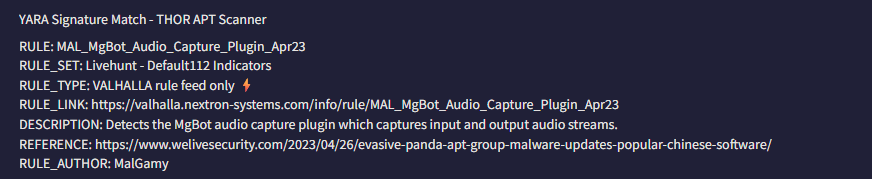

**Please note:** The artefacts used in this scenario were retrieved from a real-world cyber-attack. Hence, it is advised that interaction with the artefacts be done only inside the attached VM, as it is an isolated environment.

**Task 1 - Challenge Scenario**

It's a Friday evening at PandaProbe Intelligence when a notification appears on your CTI platform. While most are already looking forward to the weekend, you realise you must pull overtime because SwiftSpend Finance has opened a new ticket, raising concerns about potential malware threats. The finance company, known for its meticulous security measures, stumbled upon something suspicious and wanted immediate expert analysis.

As the only remaining CTI Analyst on shift at PandaProbe Intelligence, you quickly took charge of the situation, realising the gravity of a potential breach at a financial institution. The ticket contained multiple file attachments, presumed to be malware samples.

With a deep breath, a focused mind, and the longing desire to go home, you began the process of:

1. Downloading the malware samples provided in the ticket, ensuring they were contained in a secure environment.
2. Running the samples through preliminary automated malware analysis tools to get a quick overview.
3. Deep diving into a manual analysis, understanding the malware's behaviour, and identifying its communication patterns.
4. Correlating findings with global threat intelligence databases to identify known signatures or behaviours.
5. Compiling a comprehensive report with mitigation and recovery steps, ensuring SwiftSpend Finance could swiftly address potential threats.

**Note:** While the web browser (i.e., Chromium) will immediately start after boot up, it may show a tab that has a "502 Bad Gateway" error message displayed. This is because the DocIntel platform takes about 5 more minutes to finish starting up **after** the VM has completely booted up. After 5 minutes, you can **refresh** the page in order to view the login page. We appreciate your patience. The ticket details can be found by logging in to the DocIntel platform. **OSINT, a web browser, and a text editor outside the VM will also help.**

*Q1: Who shared the malware samples?*

A: Once the VM has had a chance to boot and DocIntel platform has finished starting up, we can begin our investigation. It begins with an individual named **Oliver Bennett** submitting a ticket that is urgent.

*Q2: What is the SHA1 hash of the file "pRsm.dll" inside samples.zip?*

A: Download the provided sample to the VM. It will be password locked. As seen in the above image, the password to the encryption is "Panda321!".
Once downloaded, change directories to where *pRsm.dll* is located. Once there, we are going to check the SHA1 hash of the file. This can be done by `sha1sum pRsm.dll`.
It will return **9d1ecbbe8637fed0d89fca1af35ea821277ad2e8** as the SHA1 Hash.

*Q3: Which malware framework utilizes these DLLs as add-on modules?*

A: Upon further investigation via MITRE ATT&CK, we can find a few malware frameworks it could be. However, one sticks out as utilizing DLL files: **MgBot**. This is due to it being developed in C++ and having a module design. See this [link]([MgBot, Software S1146 | MITRE ATT&CK®](https://attack.mitre.org/software/S1146/)) for more information.

*Q4: Which MITRE ATT&CK Technique is linked to using pRsm.dll in this malware framework?*

A: The MITRE ATT&CK Technique linked to using *pRsm.dll* is **T1123 AKA Audio Capture**. This can be found by investigating the DLL on MITRE ATT&CK, or submitting the hash to VirusTotal. I personally did the latter and cross-referenced with MITRE ATT&CK later.

It also has a YARA match: 

*Q5: What is the CyberChef defanged URL of the malicious download location first seen on 2020-11-02?*

A: Find a reference article to find the associated URL. The link from the image above can be found right [here]([Evasive Panda APT group delivers malware via updates for popular Chinese software](https://www.welivesecurity.com/2023/04/26/evasive-panda-apt-group-malware-updates-popular-chinese-software/)). Scrolling down, we can see the URL. Copy this, and defang it via CyberChef: 

*Q6: What is the CyberChef defanged IP address of the C&C server first detected on 2020-09-14 using these modules?*

A: Scrolling down further in the article linked, we can find the C2 networks associated with the attack. Find the one dated as *2020-09-14* and defang it via CyberChef. 

*Q7: What is the SHA1 hash of the spyagent family spyware hosted on the same IP targeting Android devices on November 16, 2022?*

A: On [Virustotal]([VirusTotal - Home](https://www.virustotal.com/gui/home/upload)), let's search our defanged IP address from the previous question. From here, go to the relations tab. This will give us a hash we can look up.

Look up the MD5 hash associated with Android. 

This will bring us to the actual spyware page we are looking for. Underneath the details section, we will have our answer on the second line: a SHA1 Hash. 

**Thanks for Reading!**