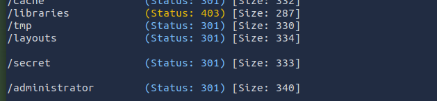
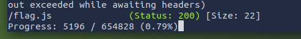
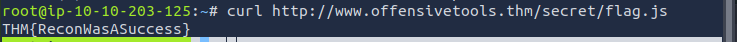
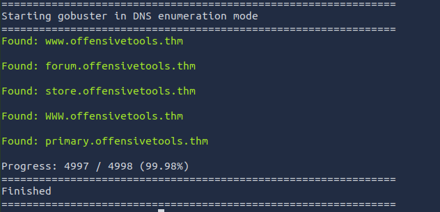
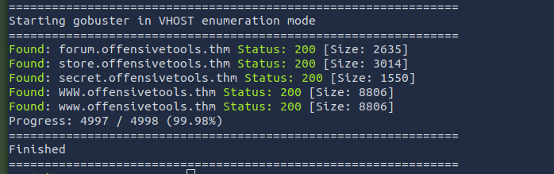

**Task 2 - Environment and Setup**

Really quickly, before we begin, we have a quick little thing to set up, and that is a nameserver. We need to create a text file with our attack machine's IP. This can be done with: *sudo nano /etc/resolv-dnsmasq*. This will allow us to edit the file or create it. Make sure the first line is populated with: **nameserver TARGET IP**. 

**Task 3 - Gobuster: Introduction**

*Q1: What flag do we use to specify the target URL?*

A: To specify a URL, we use the *-u* flag to specify a target URL. An example is: *gobuster dir -u "http://www.example.com"*

*Q2: What **command** do we use for the subdomain enumeration mode?*

A: In order to enter subdomain enumeration mode, we need to use the **dns** command in gobuster.

**Task 4 - Use Case: Directory and File Enumeration**

*Q1: Which flag do we have to add to our command to skip the TLS verification? Enter the long flag notation.*

A: **--no-tls-validation** is the command we would use to skip TLS verification in the long flag notation. The short form flag notation is **-k**.

*Q2: Enumerate the directories of www.offensivetools.thm. Which directory catches your attention?*

A: To begin, we need to initiate gobuster. This can be done via the following command: *gobuster dir -u "www.offensivetools.thm" -w /usr/share/wordlists/dirbuster/directory-list-2.3-medium.txt -x .php,.js* It is also highly recommended to use the -t flag to increase the number of threads. Let it run, it may take a few minutes.

As seen by the image above, we have an ominous directory called /secret... 

*Q3: Continue enumerating the directory found in question 2. You will find an interesting file there with a .js extension. What is the flag found in this file?*

A: Firstly, we need modify our command a little bit to direct gobuster to out "secret" directory. Let's go ahead and change our command: *"gobuster dir -u "www.http://offensivetools.thm/secret/" -w /usr/share/wordlists/dirbuster/directory-list-2.3-medium.txt -x .php,.js -t 64"*.

Please do keep in mind, in order to find the answer, the **-x .js** flag needs to be present in the command. Otherwise, gobuster will not find .js files.

Below, we see a suspicious file... **/flag.js**

Now that we know what we are looking for, let's run a quick **curl** command to read what the file contains. We do this through the following:
*curl http://www.offensivetools.thm/secret/flag.js*.

We now see our flag! 

**Task 5 - Use Case: Subdomain Enumeration**

*Q1: Apart from the dns keyword and the -w flag, which **shorthand flag** is required for the command to work?*

A: This question is a little bit of a trick question. The answer is in the question itself. They are looking for the **shorthand** flag of the dns keyword. This is **-d**.

*Q2: Use the commands learned in this task. How many subdomains are configured for the offensivetools.thm domain?*

A: Now that we know how to use the dns keyword, let's put it to good use.
Let's run the following command:
*gobuster dns -d offensivetools.thm -w /usr/share/wordlists/SecLists/Discovery/DNS/subdomains-top1million-5000.txt*

After completion of the enumeration, we can see that there are **4** subdomains configured. The top domain does not count, as it is not a subdomain.

**Task 6 - Use Case: Vhost Enumeration**

*Q1: Use the commands learned in this task to answer the following question: How many vhosts on the offensivetools.thm domain reply with status code 200?*

A: To begin, remember task 1. **Be sure you have this set up!** Once complete, run the following gobuster command:
*gobuster vhost -u "http://10.10.60.221" --domain offensivetools.thm -w /usr/share/wordlists/SecLists/Discovery/DNS/subdomains-top1million-5000.txt --append-domain --exclude-length 250-320*

As seen in the image above, we can see that 4 vhosts on the offensivetools.thm domain reply with status code 200. The bottom two are the same, thus our answer is **4**.

**Thanks for reading!**