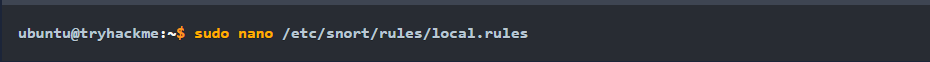
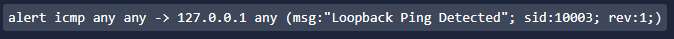
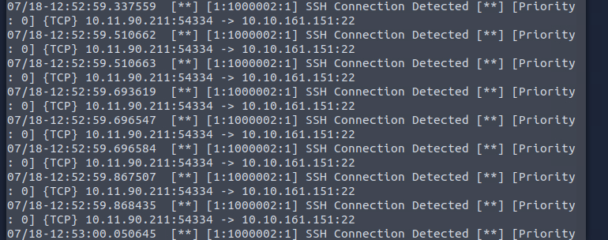
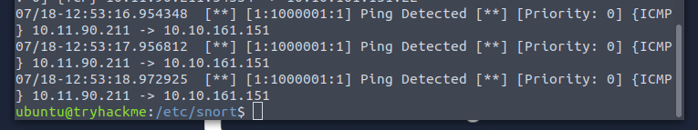

**Task 1 - What is an IDS**

*Q1: Can an intrusion detection system (IDS) prevent the threat after it detects it? Yea/Nay*

A: **No**, an IDS cannot prevent a threat after detection. An IDS simply detects that a threat is present. An IPS (Intrusion Prevention System) prevents the threat.

**Task 2 - Types of IDS**

*Q1: Which type of IDK is deploted to detect threats throughout the network?*

A: A **NIDS**, or **Network Intrusion Detection System** is deployed in order to detect threats throughout a network.

*Q2: Which IDS leverages both signature-based and anomaly-based detection techniques?*

A: A **Hybrid IDS** leverages both signature-based and anomaly-based detection methods.

**Task 3 - IDS Example: Snort**

*Q1: Which mode of Snort helps us to log the network traffic in a PCAP file?*

A: **Pocket Logging Mode** is the mode of Snort that helps log network traffic, and puts it in a PCAP file for logging purposes.

*Q2: What is the primary mode of Snort called?*

A: **Network Intrusion Detection System Mode** is the primary mode of Snort. It monitors network traffic in real time, and applies its tule files to identify any match to known attack patterns.

**Task 4 - Snort Usage**

*Q1: Where is the main directory of Snorth that stores its files?*

A: **/etc/snort** is where the main directory of Snort stores its files.

*Q2: Which field in the Snort rule indicates the revision number of the rule?*

A: The **rev** field indicates the revision number of a given rule in Snort.

*Q3: Which protocol is defined in the sample rule created in the task?*

A: **ICMP** is the protocol defined in the sample rule created within the task. ICMP stands for Internet Control Message Protocol. Please see the above image for the protocol being defined in the sample rule.

*Q4: What is the file name that contains custom rules for Snort?*

A: **local.rules** is the file name that contains custom rules intended for use with Snort.

**Task 5 - Practical Lab**

*Q1: What is the IP address of the machine that tried to connect to the subject machine using SSH?*

A: Upon changing our directory to */etc/snort* and then running our snort command as seen in the sample using the *Intro_to_IDS.pcap* file, we will see many SSH connections being detected. See the image below: 

We can see that the IP is **10.11.90.211**.

*Q2: What other rule message besides the SSH message is detected in the PCAP file?*

A: Scrolling down further in the PCAP file, we can see a message other than the SSH one. We see **Ping Detected**. 

*Q3: What is the sid of the rule that detects SSH?*

A: Upon inspect the attempted SSH connection further, we can see the sid is **1000002**.

**Thanks for reading!**