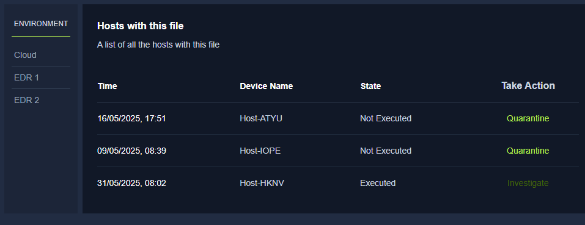
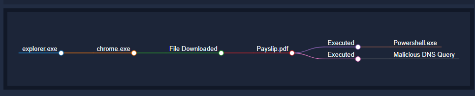

**Task 2 - What are Incidents?**

*Q1: What is triggered after an event or group of events point at a harmful activity?*

A: An **Alert** is triggered after an event, or group of events point at a potentially harmful activity to the environment.

*Q2: If a security solution correctly identifies a harmful activity from a set of events, what type of alert is it?*

A: When a security solution correctly identifies a harmful activity from a set of events, it is known as a **True Positive**. They can also be referred to as incidents.

*Q3: If a fire alarm is triggered by smoke after cooking, is it a true positive or a false positive?*

A: If the fire alarm is triggered by smoke after cooking, it is a **False Positive**, as there is no immediate danger in the smoke after cooking.

**Task 3 - Types of Incidents**

*Q1: A user's system got compromised after downloading a file attachment from an email. What type of incident is this?*

A: When a user's system is compromised due to downloading a file attachment from a potentially malicious email, it is known as a **Malware Infection**. This commonly occurs via phising attacks.

*Q2: What type of incident aims to disrupt the availability of an application?*

A: A **Denial of Service (DoS)** attack aims to disrupt the current availability of an application. 

**Task 4 - Incident Response Process**

*Q1: The security team disables a machine's internet connection after an incident. Which phase of the SANS IR lifecycle is followed here?*

A: The phase of the SANS IR lifecycle being followed is the **Containment** phase. Immediately after identifying an incident, it is critical that it does not spread across the network to other devices. Containment addresses this issue by isolating the device effected.

*Q2: Which phase of NIST corresponds with the lessons learned phase of the SANS IR lifecycle?*

A: The lessons learned phase of the SANS IR lifecycle corresponds with the **Post Incident Activity** phase of NIST.

**Task 5 - Incident Response Techniques**

*Q1: Step-by-step comprehensive guidelines for incident response are known as?*

A: **Playbooks** are known as step-by-step guidelines defined in great detail for the purpose of incident response.

**Task 6 - Lab Work Incident Response**

**Scenario:** In this task, you will initiate an incident by downloading an attachment from a phishing email. The attachment is malware. Once you download the file, an incident begins. You will now start investigating the incident. The first phase is to see how many hosts are infected with this same file, as there are many chances that a single phishing campaign targets multiple employees within the same organization. You will see some hosts on which this file was executed after getting downloaded and some hosts on which this file was only downloaded. You will perform the necessary actions on all these hosts and see a detailed timeline of events in the infected host.

*Q1: What was the name of the malicious email sender?*

A: **Jeff Johnson** is the name of the malicious email sender. This is due to the attached payslip.pdf file in the email.

*Q2: What was the threat vector?*

A: The payslip.pdf file was downloaded via an **Email Attachment**.

*Q3: How many devices downloaded the email attachment?*

A: **Three** devices in total downloaded the email attachment. Two were able to be quarantined.

*Q4: How many devices executed the file?*

A: Only **One** device actually executed the file. The device was then isolated and investigated.

*Q5: What is the flag found at the end of the exercise?*

A: Go through the web exercise. At the end after you finish the case, the flag will appear on your screen.

**Thanks for reading!**