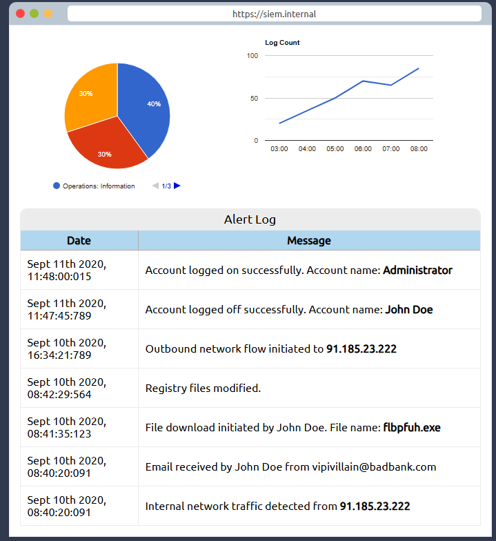

**Task 2 - Cyber Threat Intelligence**

*Q1: What does CTI stand for?*

A: The acronym "CTI" stands for **Cyber Threat Intelligence**.

*Q2: IP addresses, Hashes and other threat artefacts would be found under which Threat Intelligence classification?*

A: IP addresses, hashes, and other threat artefacts would be classified under the **Technical Intel** classification.

**Task 3 - CTI Lifecycle**

*Q1: At which phase of the CTI lifecycle is data converted into usable formats through sorting, organizing, correlation and presentation?*

A: The **Processing** phase of the CTI lifecycle is where the data collected is converted into a usable format through processes such as sorting, organizing, correlation, and presentation.

*Q2: During which phase do security analysts get the chance to define the questions to investigate incidents?*

A: The **Direction** phase is where security analysts have the chance to pose and define questions in terms of the scope of the incident up for investigation.

**Task 4 - CTI Standards & Frameworks**

*Q1: What sharing models are supported by TAXII?*

A: The **Collection and Channel** sharing models are supported by TAXII (Trusted Automated eXchange of Indicator Information).

*Q2: When an adversary has obtained access to a network and is extracting data, what phase of the kill chain are they on?*

A: If an adversary has obtained access to a network and is extracting data, they are on the final phase of the kill chain: **Actions on Objectives**.

**Task 5 - Practical Analysis**

*Q1: What was the source email address?*

A: Looking at the static site, we see a simulated SIEM platform. The event on September 10th, 200 at 08:40:20:091 shows the malicious email: **vipivillain@badbank.com**.

*Q2: What was the name of the file downloaded?*

A: As seen in the image above in the previous question, the event at the time Sept 10th 2020, 08:41:35:123 shows that a file download was initiated with the name **flbpfuh.exe**.

*Q3: After building the threat profile, what message do you receive?*

A: Fill in the infographic and prompts upon clicking the buttons. This will check your knowledge on reading SIEM event logs. 

The Victim Email recipient is **John Doe**.
The User Victim Logged Account is **Administrator**.
The Threat Actor Extraction IP Address is **91.185.23.222**.
The Threat Actor Email Address is **vipivillain@badbank.com**.
The Malware Tool is **flbpfuh.exe**.

Upon feeding the answers into the static site, it should pop up with the flag, and our answer.

**Thanks For Reading!**