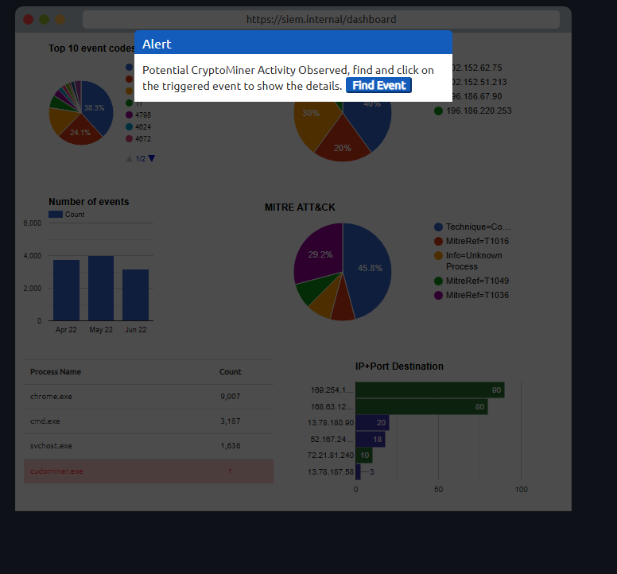

**Task 1 - Introduction**

*Q1: What does SIEM stand for?*

A: **SIEM** stands for **Security Information and Event Management system**.

**Task 2 - Network Visibility through SIEM**

*Q1: Is Registry-related activity host-centric or network-centric?*

A: Registry-related activity is **host-centric**. Registries are usually stored on the host, and network-centric log sources require a connection to a separate machine, whether it be SSH, FTP, or through the internet.

*Q2: Is VPN related activity host-centric or network-centric?*

A: Using a VPN in any sort of activity is a **Network-centric** activity. The concept of a VPN modifies and encrypts your connection.

**Task 3 - Log Sources and Log Ingestion**

*Q1: In which location within a Linux environment are HTTP logs stored?*

A: The file path to the HTTP logs within a Linux environment is **/var/log/httpd**.

**Task 5 - Analyzing Logs and Alerts**

*Q1: Which Event ID is generated when event logs are removed?*

A: Event ID **104** is generated when an event log(s) are removed. It will trigger an alert.

*Q2: What type of alert may require tuning?*

A: A **False Alarm** may require some tuning to avoid having false positives appearing as alerts.

**Task 6 - Lab Work**

In the static lab attached, a sample dashboard and events are displayed. When a suspicious activity happens, an Alert is triggered, which means some events match the condition of some rule already configured. Complete the lab and answer the following questions.

*Q1: Click on Start Suspicious Activity, which process caused the alert?*

A: We can see upon clicking the *Start Suspicious Activity* button, that we have a potential CryptoMiner activity being observed. As seen, it is called **cudominer.exe**.

*Q2: Find the event that caused the alert, which user was responsible for the process execution?*

A: Upon scrolling to the right, we can see that a process through the file path *C:\Users\Chris.fort\temp\cudominer.exe* began running according to the windows event log. In the image below and in the file path, we can see the user that was responsible for the process execution was **Chris.fort**.

*Q3: What is the hostname of the suspect user?*

A: Scrolling a little bit more to the left of the above image, we can see the hostname of the suspect user is **HR_02**.

*Q4: Examine the rule and the suspicious process; which term matched the rule that caused the alert?*

A: The executable that raised the alert in the first place was called *cudominer.exe*. The term "miner" is in the name of the executable, and returned a true value for the EventID, thus, our term for our answer is **miner**.

*Q5: What is the best option that represents the event? Choose from the following: False-Positive, True-Positive*

A: In this case, this event represents a **True-Positive**. A user executed a malicious file in the form of a cryptocurrency miner.

*Q6: Selecting the right ACTION will display the flag. What is the FLAG?*

A: Check the *True-positive and isolate the host* option, and the flag will appear on your screen. Congratulations on completing the practical exercise!

**Thank you for reading!**

