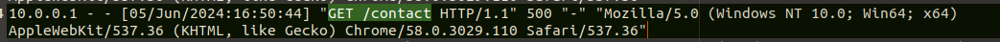

**Task 1 - Introduction to Logs**

*Q1: Where can we find the majority of attack traces in a digital system?*

A: **Logs** are where we can find the majority of attack traces on a digital system.

**Task 2 - Types of Logs**

*Q1: Which type of log contains information regarding the incoming and outgoing traffic in the network?*

A: **Network Logs** contain the information regarding incoming and outgoing traffic on a given network.

*Q2: Which type of logs contains the authentication and authorization events?*

A: **Security Logs** contain the authentication and authorization events on a given network.

**Task 3 - Windows Event Logs Analysis**

*Q1: What is the name of the last user account created on this system?*

A: **hacked** is the name of the last user account created on the system.

*Q2: Which user account created the above account?*

A: The **Administrator** user account created the account mentioned in question 1.

*Q3: On what date was this user account enabled? Format: M/D/YYYY*

A: The user account was enabled on **June 7th, 2024**.

*Q4: Did this account undergo a password reset as well? Format: Yes/No*

A: **Yes**, this account did undergo a password reset.

**Task 4 - Web Server Access Logs Analysis**

*Q1: What is the IP which made the last **GET** request to URL: "/contact"?*

A: **10.0.0.1** is the last IP which made a **GET** request to the /contact URL.

*Q2: When was the last **POST** request made by IP: "172.16.0.1"?*

A: The last **POST** request made by 172.16.0.1 was made on **June 6th, 2024 at 13:55:44**.

*Q3: Based on the answer from question number 2, to which URL was the **POST** request made?*

A: **/contact** is the URL that the **POST** request was made to. This can be seen in the figure above.

**Thank you for reading!** 