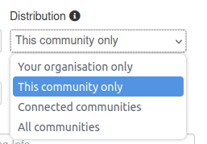
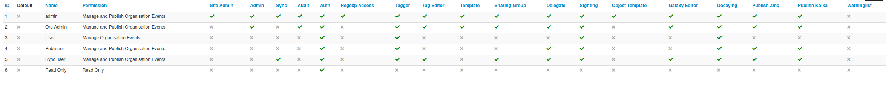
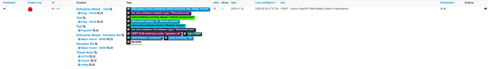
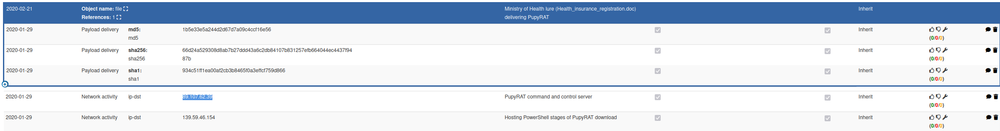
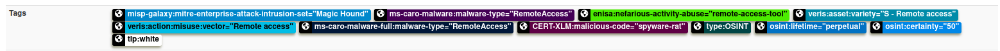

**Room Overview**
**MISP - MALWARE INFORMATION SHARING PLATFORM**

This room explores the MISP Malware & Threat Sharing Platform through its core objective to foster sharing of structured threat information among security analysts, malware researchers and IT professionals.

**Task 3 - Using the System**

Dashboard  

The analyst's view of MISP provides you with the functionalities to track, share and correlate events and IOCs identified during your investigation. The dashboard's menu contains the following options, and we shall look into them further:

- **Home button:** Returns you to the application's start screen, the event index page or the page set as a custom home page using the star in the top bar.
- **Event Actions:** All the malware data entered into MISP comprises an event object described by its connected attributes. The Event actions menu gives access to all the functionality related to the creation, modification, deletion, publishing, searching and listing of events and attributes.
- **Dashboard:** This allows you to create a custom dashboard using widgets.
- **Galaxies:** Shortcut to the list of [MISP Galaxies](https://github.com/MISP/misp-book/blob/main/galaxy) on the MISP instance. More on these on the Feeds & Taxonomies Task.
- **Input Filters:** Input filters alter how users enter data into this instance. Apart from the basic validation of attribute entry by type, the site administrators can define regular expression replacements and blocklists for specific values and block certain values from being exportable. Users can view these replacement and blocklist rules here, while an administrator can alter them.
- **Global Actions:** Access to information about MISP and this instance. You can view and edit your profile, view the manual, read the news or the terms of use again, see a list of the active organisations on this instance and a histogram of their contributions by an attribute type.
- **MISP:** Simple link to your baseurl.
- **Name:** Name (Auto-generated from Mail address) of currently logged in user.
- **Envelope:** Link to User Dashboard to consult some of your notifications and changes since the last visit. Like some of the proposals received for your organisation.
- **Log out:** The Log out button to end your session immediately.

*Q1: How many distribution options does MISP provide to share threat information?*

A: Under the "Add Event" section on the left side of the dashboard, there is a distribution option with a dropdown menu. Upon clicking the dropdown, we see that there are **4** options for distribution:

*Q2: Which user has the role to publish events?*

A: At the top menu, go to "Global Access". From the dropdown, go to "Role Permissions". Once there, we can see all the user groups on the MISP platform. From this, we can determine that the **Org Admin** role is the one we are looking for.

**Feeds and Taxonomies**

Feeds are resources that contain indicators that can be imported into MISP and provide attributed information about security events. These feeds provide analysts and organisations with continuously updated information on threats and adversaries and aid in their proactive defence against attacks.

MISP Feeds provide a way to:

- Exchange threat information.
- Preview events along with associated attributes and objects.
- Select and import events to your instance.
- Correlate attributes identified between events and feeds.

Feeds are enabled and managed by the **Site Admin** for the analysts to obtain information on events and indicators.

A taxonomy is a means of classifying information based on standard features or attributes. On MISP, taxonomies are used to categorise events, indicators and threat actors based on tags that identify them.

Analysts can use taxonomies to:

- Set events for further processing by external tools such as [VirusTotal](https://virustotal.com/).
- Ensure events are classified appropriately before the Organisation Admin publishes them.
- Enrich intrusion detection systems' export values with tags that fit specific deployments.

Taxonomies are expressed in machine tags, which comprise three vital parts:

- **Namespace:** Defines the tag's property to be used.
- **Predicate:** Specifies the property attached to the data.
- **Value:** Numerical or text details to map the property.

(Source: MISP)

Taxonomies are listed under the _Event Actions_ tab. The site admin can enable relevant taxonomies.

## Tagging

Information from feeds and taxonomies, tags can be placed on events and attributes to identify them based on the indicators or threats identified correctly. Tagging allows for effective sharing of threat information between users, communities and other organisations using MISP to identify various threats.

In our CobaltStrike event example, we can add tags by clicking on the buttons in the **Tags** section and searching from the available options appropriate to the case. The buttons represent _global_ tags and _local_ tags, respectively. It is also important to note that you can add your unique tags to your MISP instance as an analyst or organisation that would allow you to ingest, navigate through and share information quickly within the organisation.

### Tagging Best Practices

Tagging at Event level vs Attribute Level

Tags can be added to an event and attributes. Tags are also inheritable when set. It is recommended to set tags on the entire event and only include tags on attributes when they are an exception from what the event indicates. This will provide a more fine-grained analysis.

The minimal subset of Tags

The following tags can be considered a must-have to provide a well-defined event for distribution:

- **[Traffic Light Protocol:](https://www.first.org/tlp/)** Provides a colour schema to guide how intelligence can be shared.
- **Confidence:** Provides an indication as to whether or not the data being shared is of high quality and has been vetted so that it can be trusted to be good for immediate usage.
- **Origin:** Describes the source of information and whether it was from automation or manual investigation.
- **Permissible Actions Protocol:** An advanced classification that indicates how the data can be used to search for compromises within the organization.

**Task 5 - Scenario Event**

[CIRCL](https://www.circl.lu/) (Computer Incident Respons Center Luxembourg) published an event associated with PupyRAT infection. Your organisation is on alert for remote access trojans and malware in the wild, and you have been tasked to investigate this event and correlate the details with your SIEM. Use what you have learned from the room to identify the event and complete this task.

*Q1: What event ID has been assigned to the PupyRAT event?*

A: To begin, let's start at the home dashboard. On the right side of the screen, we can search for our event. Search "PupyRAT" in the search bar. This query should have one result, with the ID **1145**.

*Q2: The event is associated with the adversary gaining ______ into organisations.*

A: The event associated with the adversary is gaining **Remote Access** into an organization. Remember, RAT in cybersecurity stands for Remote Access Trojan.

*Q3: What IP address has been mapped as the PupyRAT C2 Server?*

A: Select the event, and scroll down in the report. We can see that the C2 server has an IP address of **89.107.62.39**.

*Q4: From the Intrusion Set Galaxy, what attack group is known to use this form of attack?*

A: According to the MISP Intrusion Set Galaxy and the tags section for this specific attack, the group known as **Magic Hound** is associated and known to use this form of attack.

*Q5: There is a taxonomy tag set with a Certainty level of 50. Which one is it?*

A: The **osint** tag, as seen in the previous image has a certainty level of 50.

**Thanks for Reading!**
