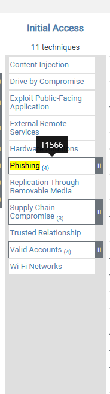
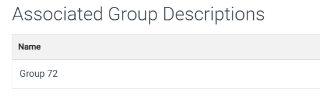
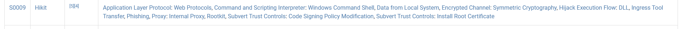
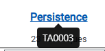
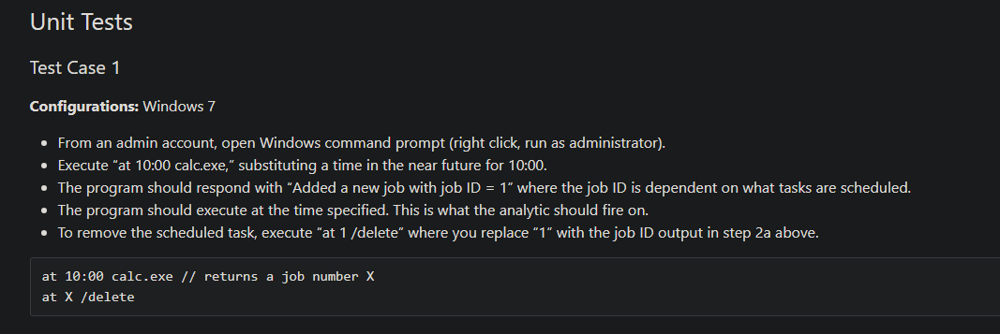
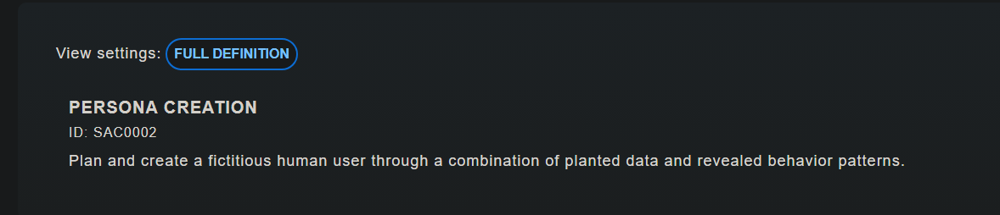
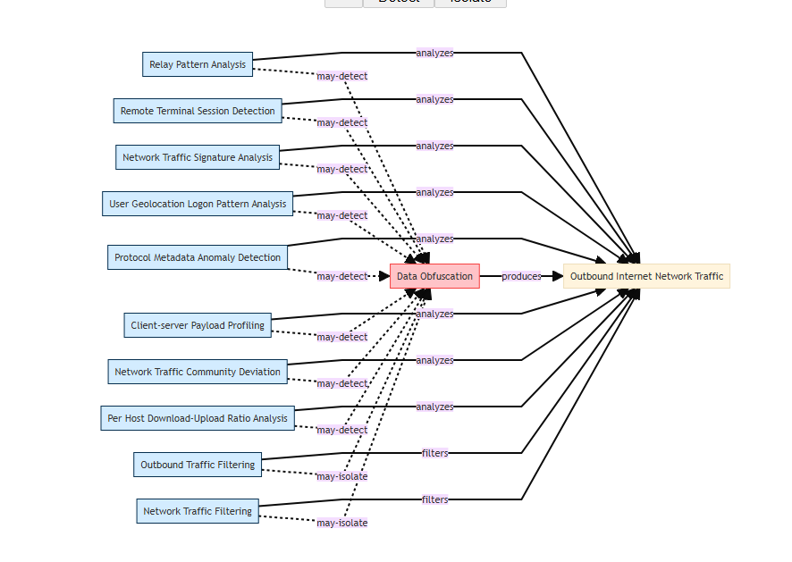
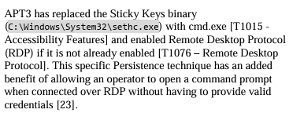
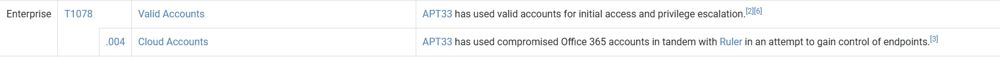

**Task 3 ATT&CK® Framework**

*Q1: Besides Blue teamers, who else will use the ATT&CK Matrix?*

A: **Red Teamers** will also use the ATT&CK Matrix. This is due to the red team running penetration tests in the organization.

*Q2: What is the ID for this technique?*

A: The technique in question is phishing. With this information, we can get an ID from MITRE's website.

As seen above, the Phishing technique has the ID **T1566**.

*Q3: Based on this technique what mitigation covers identifying social engineering techniques?*

A: **User Training** is often the best mitigation to phishing attempts, as it helps the user identify the social engineering technique in the first place, rendering it ineffective.

*Q4: What are the data sources for Detection?*

A: The answer will all be forms of detection for phishing. These include **Application logs, Files, and Network Traffic**.

*Q5: Which are the first two groups to have used spear-phishing in their campaigns?*

A: According to MITRE, the first two groups to have used spear-phishing in their campaigns are **Axiom, and Gold SOUTHFIELD**.

*Q6: Based on the information for the first group, what are their associated groups?*

A: Upon looking into Axiom on the MITRE website, we can see that they are associated with **Group 72**.

*Q7: What software is associated with this group that lists phishing as a technique?*

A: **Hikit** is the software associated with the group that lists phishing as a technique. See Below.

*Q8: What is the description for this software?*

A: According to MITRE, after clicking on Hikit, it reads the following: **Hikit is malware that has been used by Axiom for late-stage persistence and exfiltration after the initial compromise.**. This is our answer.

*Q9: This group overlaps (slightly) with which other group?*

A: Axiom overlaps slightly with another group called **Winnti Group**. Although, through their TTPs, their objectives and motives remain different.

*Q10: How many techniques are attributed to this group?*

A: For clarity, the question is referring to Axiom. They are attributed to **15** different techniques.

**Task 4 - CAR Knowledge Base**

*Q1: What tactic has an ID of TA0003?*

A: The tactic with the ID of TA0003 is **Persistence**.

*Q2: What is the name of the library that is a collection of Zeek (BRO) scripts?*

A: The name of the library that is a collection of Zeek (Formerly BRO) scripts is called **BZAR**.

*Q3: What is the name of the technique for running executables with the same hash and different names?*

A: The technique that is known for running executables with the same hash and a different name is known as **Masquerading**.

*Q4: Examine CAR-2013-05-004. Besides implementations, what additional information is provided to analysts to ensure coverage for this technique?*

A: Besides implementations, **Unit Tests** are also provided for analysts to ensure coverage regarding the technique.

**Task 5 - MITRE Engage**

*Q1: Under Prepare, what is ID SAC0002?*

A: Under the prepare section ID SAC0002 is **Persona Creation**.

*Q2: What is the name of the resource to aid you with the engagement activity from the previous question?*

A: The **Persona Profile Worksheet** is the resource that will aid us with the engagement activity from the previous question.

*Q3: Which engagement activity baits a specific response from the adversary?*

A: The **Lures** engagement activity baits a specific response from an adversary.

*Q4: What is the definition of Threat Model?*

A: According to MITRE, the definition of a threat model is as follows: **A risk assessment that models organizational strengths and weaknesses**.

**Task 6 - MITRE D3FEND**

*Q1: What is the first MITRE ATT&CK technique listed in the ATT&CK Lookup dropdown?*

A: Click the drop-down menu in the top-left. The first MITRE ATT&CK technique shown is **Data Obfuscation**.

*Q2: In D3FEND Inferred Relationships, what does the ATT&CK technique from the previous question produce?*

A: Click on data obfuscation now. See the graph, and where all the nodes point to. This is our answer: **Outbound Internet Network Traffic**.

**Task 7 - ATT&CK Emulation Plans**

*Q1: In Phase 1 for the APT3 Emulation Plan, what is listed first?*

A: In Phase 1 of the APT3 Emulation Plan, **C2 Setup** is listed as the first step.

*Q2: Under Persistence, what binary was replaced with cmd.exe?*

A: 

According to APT3, **sethc.exe** under the persistence category replaces cmd.exe.

*Q3: Examining APT29, what C2 frameworks are listed in Scenario 1 Infrastructure?*

A: According to the GitHub of APT29, the C2 frameworks listed in scenario 1 infrastructure are **pupy and the metasploit framework**.

*Q4: What C2 framework is listed in Scenario 2 Infrastructure?*

A: **PoshC2** is the framework listed in scenario 2 infrastructure.

*Q5: Examine the emulation plan for Sandworm. What webshell is used for Scenario 1? Check the MITRE ATT&CK for the Software ID for the webshell. What is the ID?*

A: Upon examining the emulation plan for Sandworm, we see the webshell utilized is called P.A.S.. Going back to MITRE ATT&CK, we can search for P.A.S., and find our ID. Our answer is **P.A.S.,S0598**.

**Task 8 - ATT&CK and Threat Intelligence**

*Q1: What is a group that targets your sector who has been in operation since at least 2013?*

A: **APT33** is a group that targets our sector, and has been in operation since at least 2013. This information can be found in the MITRE ATT&CK CTI.

*Q2: As your organization is migrating to the cloud, is there anything attributed to this APT group that you should focus on? If so, what is it?*

A: Upon examining APT33's page on MITRE ATT&CK, we see that **Cloud Accounts** should be focused on to be secured, as they have been attributed to compromising them.

*Q3: What tool is associated with the technique from the previous question?*

A: **Ruler** is the name of the tool associated with the technique from the previous question.

*Q4: Referring to the technique from question 2, what mitigation method suggests using SMS messages as an alternative for its implementation?*

A: **Multi-Factor Authentication** is a common mitigation method and uses SMS messages an an alternative for its implementation.

*Q5: What platforms does the technique from question 2 affect?*

A: At the top of the page, there is a list of platforms that the technique from question 2 affects. They are: **IaaS, Identity Provider, Office Suite, SaaS**.

**Thanks for Reading!**
