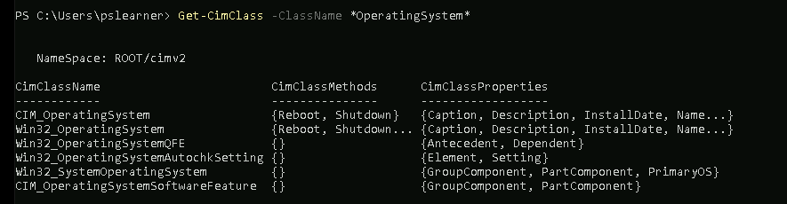
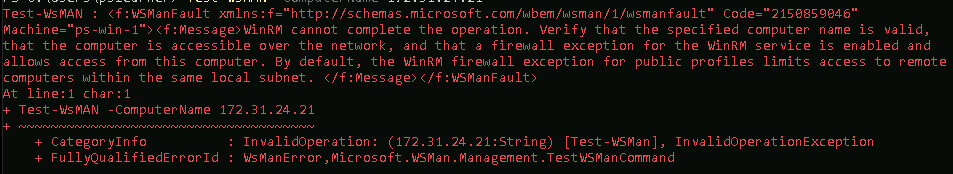

**Challenge 1: Find System Information with CIM**

To begin, we need to launch Windows PowerShell. This can be done via the search bar at the bottom of the Windows User Interface.

Run the following command: Get-Command -Noun Cim*

This will now show us the cmdlets that we can use related to CIM.

Following this, run the following command: Get-CimClass

This will return a massive range/suite of system information all accessible through CIM, ranging from hardware specifics, to software configurations.

From here, we can tell PowerShell to narrow our search results down to something more specific, such as an Operating System. Let's work on our command a little bit, and add to it:

Get-CimClass -ClassName *OperatingSystem*

We are adding what is known as a wildcard in the OperatingSystem part of the command. This will help us narrow down what we are looking for to solely OS functions.

As we see above, it really narrows our results down!

**Query Specific CIM Instances**

Now, we are going to be targeting specifics. Firstly, we care going to retrieve CPU details for our machine. This can be done via the following command: Get-CimInstance -ClassName Win32_Processor

As seen above after running the command, our CPU is an Intel Xeon Platinum 8259CL. 

Later in the lab, we will be building a system compatibility script to see if a given machine has a CPU that meets vendor requirements of at least 2.4 GHz in clock speed. We are going to run the Get-CimInstance command once again, but with more parameters and filtering: 

Get-CimInstance -ClassName Win32_Processor | Where-Object {$_.MaxClockSpeed -ge 2400}

This is just to get a feel for how PowerShell works and operates with compliance. It should return the same result as prior, as our machine's current CPU meets the criteria of our filters.

We can also use the following command for a more **direct and efficient** filtering method: Get-CimInstance -ClassName Win32_Processor -Filter "MaxClockSpeed >= 2400"

Now, we are going to apply the same concept, but to the RAM of our system: Get-CimInstance -ClassName Win32_PhysicalMemory -Filter "Capacity >= 8589934592"

In this use case, we are checking to see if our RAM is above or greater to 8 gigabytes.

Upon running the command, notice that there is no value returned. This is normal, as our machine does not have a memory bank of 8GB or more.

Now, let's take a peek at what our machine actually has memory wise. We can do this by removing our filters: Get-CimInstance -ClassName Win32_PhysicalMemory

From the command, we can see we have 4GB of memory... This machine would not be compliant unfortunately.

Finally, we are going to utilize WMI Query Language for advanced filtering. We are going to check for sufficient free disk space by inputting the following: 

Get-CimInstance -Query "SELECT * FROM Win32_LogicalDisk WHERE DeviceID = 'C:' AND FreeSpace >= 10737418240"

Upon running our query, we see that our disk space meets the requirements!

**Troubleshooting WinRM Connectivity**

To begin, we have an IP address of **172.31.24.21**. We can go ahead and query this through PowerShell:
Get-CimInstance -ClassName Win32_OperatingSystem -ComputerName '172.31.24.21'

After about 20 to 30 seconds, PowerShell will time out, and will return that it is not able to complete the operation. Its time to troubleshoot.

To begin our troubleshooting, we are going to try a built-in command. It is called Test-WSMan:
Test-WsMAN -ComputerName 172.31.24.21

After about the same amount of time, it will also fail.

Next, we are going to see if it responds to a ping at all. That's as simple as running the following in PowerShell:
ping 172.31.24.21

From the image above, we can see that it at least responds to a ping! This is a good sign.

Now, we are going to go onto the server that owns the respective IP address. Launch PowerShell as admin.

The first thing we are going to check is if WinRM is running in the first place. This can be done via the Get-Service cmdlet: Get-Service WinRM

We can see that WinRM should be running. Let's investigate further.
Its time to see if its the network's firewall causing the issue: 
Get-NetFirewallRule -DisplayGroup 'Windows Remote Management'

Alas, we have found our issue. The rules in this group are disabled! We can see this by looking at the **Enabled** property, and seeing that it is set to **False**.

Its time to re-enable the firewall rules by piping the rule group to Enable-NetFirewallRule:
Get-NetFirewallRule -DisplayGroup 'Windows Remote Management' | Enable-NetFirewallRule

This will return nothing. With the firewall hopefully, adjusted, let's switch back to our first machine and try again.

It worked! Now we can perform our first attempted query successfully:

**Create a Loop to Process Multiple Machines**

Now, we are going to utilize another tool on our original machine: Virtual Studio Code (VS Code). Once inside, use CTRL+N to open the editor.

We are now going to quickly save it with the shortcut CTRL+S. Save it under C:\Users\pslearner\cim_loop_demo.ps1

From here, we are going to write out looping script.
We are going to have a file created called *servers.txt*. This will be done via the following cmdlet: Get-Content 'C:\servers.txt'
If you would like to see it run outside the editor, press F8 while you have the line of code clicked on within the script.

Now, we are going to modify our line by adding $servers = at the beginning of it. This will let us store our server names in array for further processing.

We need a way to handle each server name in the $servers array we have now made. The **foreach** loop in PowerShell will do the trick. Add the following to the end of the script:
`foreach ($server in $servers) {`

`Write-Host "Working on $server..."`

`}`

Don't forget to save!

Now, we are going to run the script we just wrote! Let's return to PowerShell.
We run our script by specifying where saved it in the first place:
C:\Users\pslearner\cim_loop_demo.ps1

Our script now returns some text as it runs!
We are now going to replace our generic looping message with CIM queries.
Insert the following code into Visual Studio:
`foreach ($server in $servers) {`

`$os = Get-CimInstance -ClassName Win32_OperatingSystem -ComputerName $server`

`$os | Select-Object -Property PSComputerName, OSArchitecture, Version`

`}`

Our script now returns an OS Architecture:

Now, we are going to get a bit fancier. Remove the second line in our foreach loop, and replace it with the following: 
`$cpu = Get-CimInstance -ClassName Win32_Processor -ComputerName $server`

`$ram = Get-CimInstance -ClassName Win32_PhysicalMemory -ComputerName $server`

This will now store our CPU and RAM on the machine. However, it won't return anything just yet. Let's change that.

It now returns addition information! This is excellent. We can now gather data from remote systems using CMI queries!