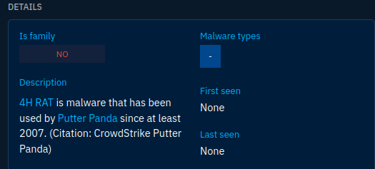
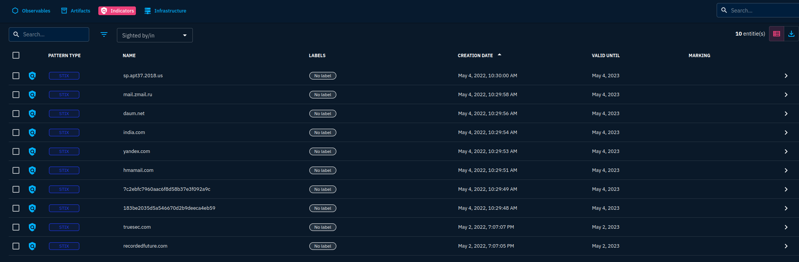
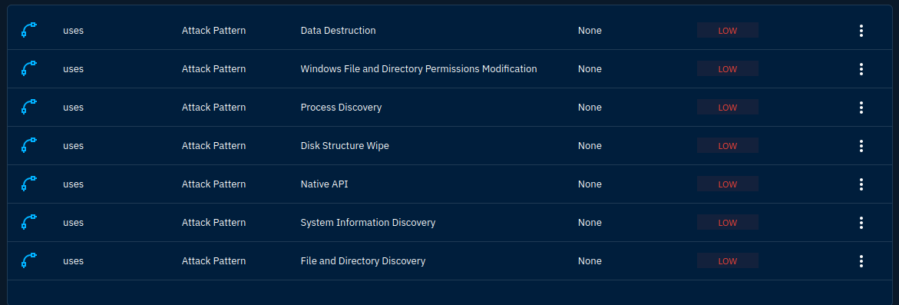
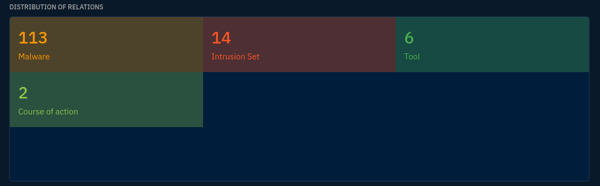
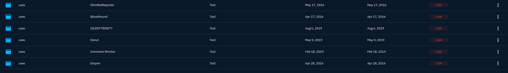
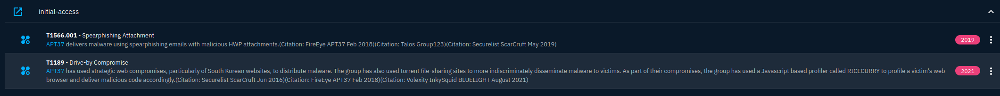

[OpenCTI](https://github.com/OpenCTI-Platform/opencti) is another open-sourced platform designed to provide organizations with the means to manage CTI through the storage, analysis, visualization and presentation of threat campaigns, malware and IOCs.

**Task 4 - OpenCTI Dashboard 1**

Firstly, we need to log in to our dashboard. This can be done by connection to the target instance in our web browser.

*Q1: What is the name of the group that uses the **4H RAT** malware?*

A: The name of the group that uses the 4H RAT malware is **Putter Panda**. This information can be found under the "Knowledge" dropdown menu, and then selecting "Arsenal". From there, search for 4H RAT.

*Q2: What kill-chain phase is linked with the **Command-Line Interface** Attack Pattern?*

A: The **Execution** phase of the kill chain is linked with the Command-Line Interface Attack Pattern.

*Q3: Within the Activities category, which tab would house the **Indicators**?*

A: Under the Activities category, the **Observations** tab would house the indicators.

**Task 5 - OpenCTI Dashboard 2**

*Q1: What Intrusion sets are associated with the Cobalt Strike malware with a Good confidence level? (Intrusion1, Intrusion2)*

A: **CopyKittens, and FIN7** are the two intrusions with a **Good** confidence level. Although I was not able to find CopyKittens with good confidence in the "Last Created Relationships" tab.

*Q2: Who is the author of the entity?*

A: We can see from the dashboard of Cobalt Strike that the author of the entity is **The MITRE Corporation**.

**Task 6 - Investigative Scenario**

As a SOC analyst, you have been tasked with investigations on malware and APT groups rampaging through the world. Your assignment is to look into the **CaddyWiper** malware and **APT37** group. Gather information from OpenCTI to answer the following questions.

*Q1: What is the earliest date recorded related to **CaddyWiper**?  Format: YYYY/MM/DD*

A: Going to the analysis tab of CaddyWiper, we see an article titled "Cisco CaddyWiper March 2022". It is dated at **March 15, 2022**.

*Q2: Which **Attack technique** is used by the malware for execution?*

A: According to the "Overview" section of CaddyWipe, the primary attack technique utilized for execution was the **Native API**.

*Q3: How many malware relations are linked to this Attack technique?*

A: Upon clicking the "Native API" section, we can see another directory on the right side of the screen. Clicking that will take us to the Native API page, where we can go to the knowledge section.

We can see that there are **113** Malware relations with Native API.

*Q4: Which 3 tools were used by the Attack Technique in 2016? (Ans: Tool1, Tool2, Tool3)*

A: On the right side of the screen when looking at Native API, we can see a "Tools" section. When se go there, we see the tools affiliated with the attack technique. Look for the ones used in 2016: **Bloodhound, Empire, and ShimRatReporter**.

*Q5: What country is **APT37** associated with?*

A: Upon searching for APT37, we can view the MITRE ATT&CK report on them. APT37 is a **North Korean** state-sponsored cyber espionage group.

*Q6: Which Attack techniques are used by the group for initial access? (Ans: Technique1, Technique2)*

A: If we scroll down on the APT37 page in the "Knowledge" section, we will see a timeline. Click the other option to see the "Global Kill Chain". Once there, scroll to "Initial Access" for our technique codes. These are **T1189, and T1566**.

**Thanks for Reading!**