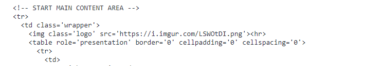
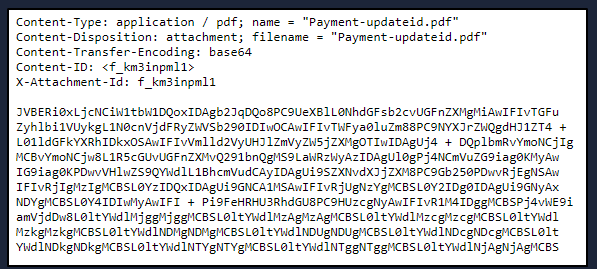
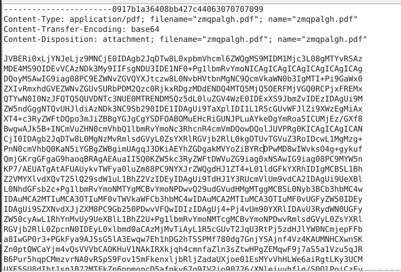
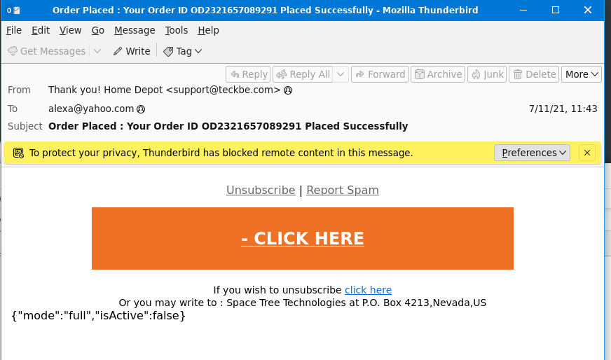

**Task 2 - The Email Address**

It's only appropriate to start this room by mentioning the man who invented the concept of emails and made the @ symbol famous. The person responsible for the contribution to the way we communicate was Ray Tomlinson. 

The invention of the email dates back to the 1970s for [ARPANET](https://www.britannica.com/topic/ARPANET). Yep, probably before you were born. Definitely, before I was born. :)

So, what makes up an email address?  

1. **User Mailbox (or Username)**
2. **@**
3. **Domain**

Let's look at the following email address, billy@johndoe.com.

1. The **user mailbox** is billy
2. **@** (thanks Ray)
3. The **domain** is johndoe.com

To simplify this even further, think about the street on which you live on.

- You can think of your street as the **domain**. 
- The recipient's first/last name, along with the house number in this scenario, represents the **user mailbox**. 

With this information, the postal worker delivering the mail knows into which mailbox to put the letter(s). 

Next, let's look at the network protocols used to send an email from the sender to the recipient.

*Q1: Email Dates Back to what time frame?*

A: The **1970s** is the decade where email dates back. It was used for ARPANET, the predecessor to the internet.

**Task 3 - Email Delivery**

There are 3 specific protocols involved to facilitate the outgoing and incoming email messages, and they are briefly listed below.

- **SMTP** (**Simple Mail Transfer Protocol)** - It is utilized to handle the sending of emails. 

- **POP3 (Post Office Protocol)** - Is responsible transferring email between a client and a mail server. 

- **IMAP (Internet Message Access Protocol)** - Is responsible transferring email between a client and a mail server.

*Q1: What port is classified as Secure Transport (STARTTLS) for SMTP?*

A: Port **587** is classified as Secure Transport (STARTTLS) for SMTP.

*Q2: What port is classified as Secure Transport for IMAP?*

A: Port **993** is classified as Secure Transport for IMAP.

*Q3: What port is classified as Secure Transport for POP3?*

A: Port **995** is classified as Secure Transport for POP3.

**Task 4 - Email Headers**

*Q1: What email header is the same as "Reply-to"?*

A: The **Return-Path** email header is the same as "Reply-to".

*Q2: Once you find the email sender's IP address, where can you retrieve more information about the IP?*

A: Once we find the email sender's IP address, we can retrieve more information from arin.net.

**Task 5 - Email Body**

*Q1: In the above screenshots, what is the URI of the blocked image?*

A: As seen in the above screenshot, we can see that the URL of the blocked image is [https://i[.]imgur[.]com[/]LSWOtDI[.]png].   

*Q2: In the screenshots above, what is the name of the PDF attachment?*

A: Once again seen in the screenshot, we can see that the PDF attachment is named **Payment-updateid.pdf**.

*Q3: In the attached virtual machine, view the information in email2.txt and reconstruct the PDF using the base64 data. What is the text within the PDF?*

A: To begin, open the *email2.txt* file found on the desktop of the VM of the lab. From here, we will see a massive string of Base64. 

Copy and paste this into a blank text file. We are now going to delete the header and footer at the top and bottom of the text file respectively.

From here, we go into the Linux CLI. Navigate to where you saved the text file. We will now enter the following: `base64 -d <filename> output.pdf`. This will create a new pdf of no harm to the machine wherever your source file was. Open this, and you will find the flag.

**Task 6 - Types of Phishing**

*Q1: What trusted entity is this email masquerading as?*

A: Open the file through an application such as Thunderbird. From the Header of the email, we can see the phishing email is posing as a **Home Depot** confirmation email.

*Q2: What is the sender's email?*

A: As seen in the screenshot above, we can see the email was sent from **support@teckbe[.]com**

*Q3: What is the subject line?*

A: As seen in the screenshot above, we can see that the subject line is the following: **Order Placed : Your Order ID OD2321657089291 Placed Successfully**.

*Q4: What is the website for the - CLICK HERE URL in a defanged format? (e.g. https://website.thm)*

A: If assistance is needed in the defanging process, CyberChef can easily assist. Enter the URL on CyberChef, and it will give you an output. It is as follows: **hxxp[://]t[.]teckbe[.]com**

**Task 7 - Conclusion**

Before ending this room, you should know what **[BEC](https://www.proofpoint.com/us/threat-reference/business-email-compromise)** (Business Email Compromise) means.

  

A BEC is when an adversary gains control of an internal employee's account and then uses the compromised email account to convince other internal employees to perform unauthorized or fraudulent actions. 

**Tip**: You should be familiar with this term. I have heard this question asked before in a job interview. 

Within this room, we covered the following:

- What makes up an email address?
- How an email travels from sender to recipient.
- How to view the source code of an email header.
- How to view the source code of an email body. 
- Understand the pertinent information we should obtain from an email we're analyzing.
- Some common techniques attackers use in spam and phishing email campaigns.

In the upcoming Phishing Analysis series, we'll look at samples of various common techniques used in phishing email campaigns, along with tools to assist us with analyzing an email header and email body.

*Q1: What is BEC?*

A: The acronym BEC stands for **Business Email Compromise**.

**Thanks For Reading!**