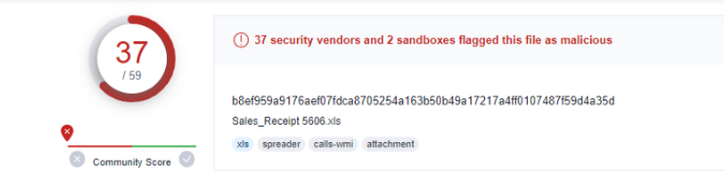
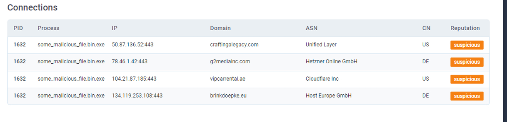
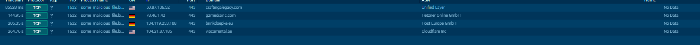
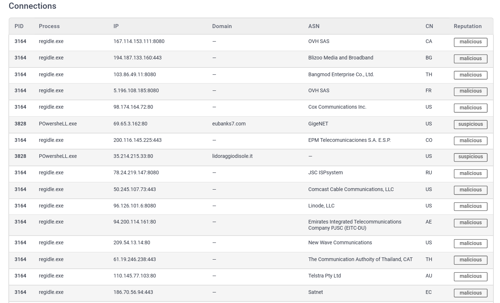
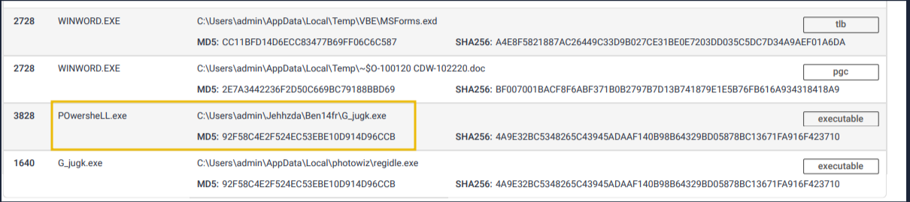
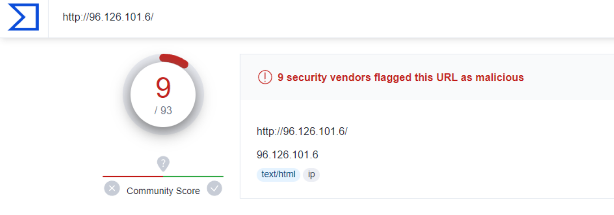
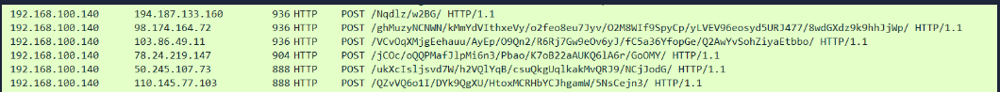

**Task 2 - Hash Values (Trivial)**

*Q1: Analyze the report associated with the hash "b8ef959a9176aef07fdca8705254a163b50b49a17217a4ff0107487f59d4a35d". What is the filename of the sample?

A: **Sales_Receipt 5606.xls** is the name of the filename in the sample provided. Please see the image below.

**Task 3 - IP Address (Easy)**

*Q1: Read the following report to answer this question. What is the first IP address the malicious process (PID 1632) attempts to communicate with?*

A: **50.87.136.52** is the IP address the malicious process with PID 1632 attempts to communicate with first. This can be seen in the image below.

*Q2: Read the following report to answer this question. What is the first domain name the malicious process (PID 1632) attempts to communicate with?*

A: Also seen in the image above, we can see the domain name under the malicious PID of 1632. It is **craftingalegacy.com**.

**Task 4 - Domain Names (Simple)**

*Q1: Go to this report on app.any.run and provide the first suspicious domain request you are seeing. You will be using this report to answer the remaining questions of this task.*

A: Once again, the suspicious domain request is **craftingalegacy.com**. This can be seen in anyrun by switching tabs at the bottom to the "connections" section.

*Q2: What term refers to an address used to access websites?*

A: A **Domain Name** refers to an address used to access websites.

*Q3: What type of attack uses Unicode characters in the domain name to imitate the known domain?*

A: A **Punycode Attack** uses Unicode characters in the domain name to imitate the known domain. This is also known as a homograph attack, or domain phishing.

*Q4: Provide the redirected website for the shortened URL using a preview: https://tinyurl.com/bw7t8p4u*

A: **https://tryhackme.com/** is the redirected website for the shortened URL provided in the question.

**Task 5 - Host Artifacts (Annoying)**

A security vendor has analysed the malicious sample for us. Review the report [here](https://assets.tryhackme.com/additional/pyramidofpain/task5-report.pdf) to answer the following questions.

*Q1: A process named regidle.exe makes a POST request to an IP address based in the United States (US) on port 8080. What is the IP address?*

A: Upon looking at the report, we need to scroll down a fair ways to look at the connections attempted. We are looking for a connection based in the US, on port 8080. The POST request that matches this criteria is on the IP **96.126.101.6**. See the image below.

*Q2: The actor drops a malicious executable (EXE). What is the name of this executable?*

A: As seen on page 39 of the report, about halfway down, we can see that the actor dropped a malicious executable by the name of **G_jugk.exe**. See the image below.

*Q3: Look at this [report](https://assets.tryhackme.com/additional/pyramidofpain/vtotal2.png) by Virustotal. How many vendors determine this host to be malicious?*

A: Looking at the report by Virustotal, **9** vendors determine the host to be malicious.

**Task 6 - Network Artifacts (Annoying)**

*Q1: What browser uses the User-Agent string shown in the screenshot?*

A: Upon investigating the User-Agent string, we can see that the browser using it is IE7, or **Internet Explorer** version 7.

*Q2: How many POST requests are in the screenshot from the pcap file?*

A: **6** POST requests are in the screenshot from the pcap file.

**Task 7 - Tools (Challenging)**

*Q1: Provide the method used to determine similarity between the files.*

A: **Fuzzy Hashing** is the method used to determine similarity between files, particularly in the example provided in the task.

*Q2: Provide the alternative name for fuzzy hashes without the abbreviation.*

A: **Context-Triggered Piecewise Hashing** is the alternative name for fuzzy hashing.

**Task 8 - TTPs (Tough)**

*Q1: Navigate to the ATT&CK Matrix webpage. How many techniques fall under the Exfiltration category?*

A: According to the Mitre ATT&CK Matrix, there are **9** techniques that fall under the "Exfiltration" category.

*Q2: Chimera is a China-based hacking group that has been active since 2018. What is the name of the commercial, remote access tool they use for C2 beacons and data exfiltration?*

A: **Cobalt Strike** is the name of the commercial, remote access tool they use for C2 beacons and data exfiltration. More information can be found on the Mitre ATT&CK Matrix website.

**Thanks for Reading!**