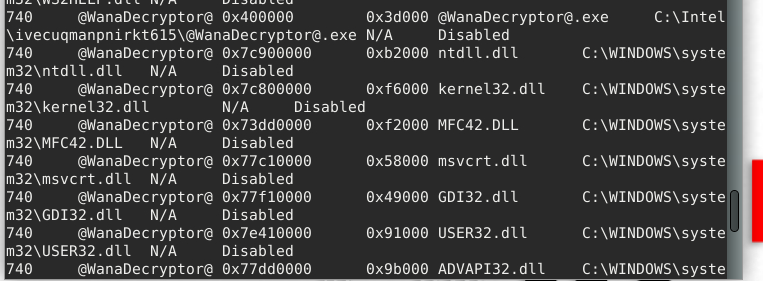

**Task 3 - File Analysis**

*Q1: What Python tool analyzes OLE2 files, commonly called Structured Storage or Compound File Binary Format?*

A: **oledump.py** is the name of the Python tool for analyzing OLE2 files. They are commonly called Structured Storage or Compound File Binary Format.

*Q2: What tool parameter we used in this task allows you to select a particular data stream of the file we are using it with?*

A: The parameter **-s** is used to select a particular data stream from the file we are using it with.

*Q3: During our analysis, we were able to decode a PowerShell script. What command is commonly used for downloading files from the internet?*

A: **Invoke-WebRequest** is the command commonly used for downloading files from the internet via PowerShell scripting. This can be found in our decoded CyberChef output. To learn more about CyberChef, please see the documentation found in this 

*Q4: What file was being downloading using the PowerShell script*

A: **Doc-3737122pdf.exe** is the name of the file that was being downloaded using the PowerShell script. See the full command above in CyberChef.

*Q5: During our analysis of the PowerShell script, we noted that a file would be downloaded. Where will the file being downloaded be stored?*

A: **$TempFile** is where the file being downloaded will be stored. This is most likely a temporary file location rooted in the system. See the above CyberChef output once again. Near the end, the -OutFile parameter is being used to determine where the file will be stored.

*Q6: Using the tool, scan another file named **possible_malicious.docx** located in the /home/ubuntu/Desktop/tasks/agenttesla/ directory. How many data streams were presented for this file?*

A: Running the tool once again, however on the file in the question, we see that there are **16** different data streams present. See the image below for more details on the process.

*Q7: Using the tool, scan another file named **possible_malicious.docx** located in the /home/ubuntu/Desktop/tasks/agenttesla/ directory. At what data stream number does the tool indicate a macro present?*

A: Looking at the image above based on the scan we just ran, we can see that on data stream number **8**, we see an indicator of a macro being present.

**Task 4 - Fake Network to Aid Analysis**

Before we answer our questions, we need to make sure inetsim is configured correctly and running on our target machine. To do this we need to edit the configuration file, and then run inetsim. 

To edit the config file, enter the following command: *sudo nano /etc/inetsim/inetsim.conf*. Once done, we should be able to edit the file. Look for *dns_default_ip*. We need to remove the "#", and then add our target IP in order to simulate the internet. After saving, it should look something like this: 

Once done, it should be hosted after running the following: *sudo inetsim*!

*Q1: Download and scan the file named **flag.txt** from the terminal using the command **sudo wget https://10.10.118.94/flag.txt --no-check-certificate**. What is the flag?*

A: Firstly, we need to download the flag. This can be done with the command provided. Replace the IP with your target machine's. Then, we need to scan the file. We can do this by how we did it in previous tasks: *oledump.py flag.exe* This should give us our flag: **Tryhackme{remnux_edition}**.

*Q2: After stopping the inetsim, read the generated report. Based on the report, what URL method was used to get the file flag.txt?*

A: Based on the report, the URL method used to get the file flag.txt was the **GET** method.

**Task 5 - Memory Investigation: Evidence Preprocessing**

*Q1: What plugin lists processes in a tree based on their parent process ID?*

A: **PsTree** lists processes in a tree based on their parent process ID.

*Q2: What plugin is used to list all currently active processes in the machine?*

A: **PsList** is the plugin used to list all currently active processes on a machine.

*Q3: What Linux utility tool can extract the ASCII, 16-bit little-endian, and 16-bit big-endian strings?*

A: The **Strings** Linux utility tool can extract the ASCII, 16-bit little-endian, and 16-bit big-endian strings we want to find.

*Q4: By running vol3 with the Malfind parameter, what is the first process identified suspected of having an injected code?*

A: Upon running vol3 with the Malfind paramete, we see that the first process identified and suspected of having injected code is **csrss.exe**.

*Q5: Continuing from the previous question, what is the second process identified suspected of having an injected code?*

A: The second process is **winlogon.exe** this can be found by scrolling a bit further down the list.

*Q6: By running vol3 with the DllList parameter, what is the file path or directory of the binary @WanaDecryptor@.exe?*

A: Upon running vol3 with the DllList parameter, we see the file path of the binary *@WanaDecryptor@.exe*. It is **C:\Intel\ivecuqmanpnirkt615**. See the image below for more details.

**Thanks for Reading!**