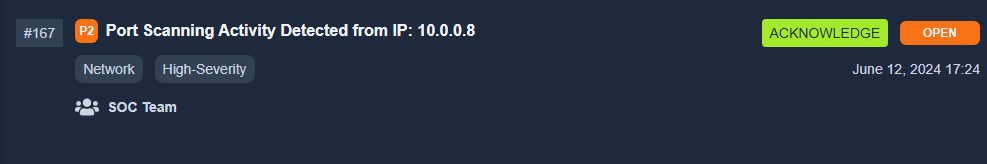
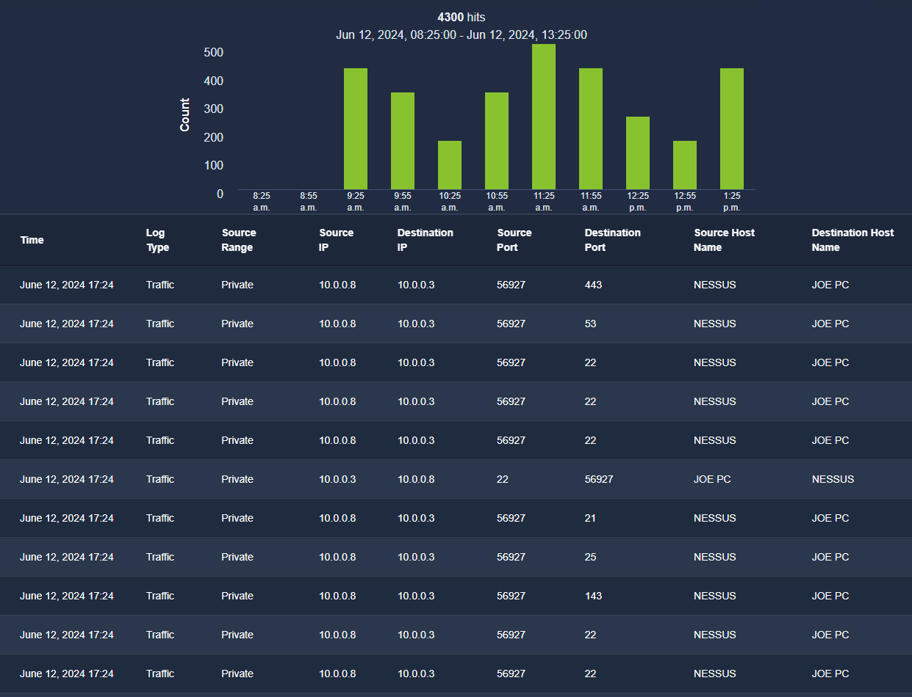

**Task 1 - Introduction to SOC**

*Q1: What does the term SOC stand for?*

A: The term **SOC** stands for **Security Operations Center**. It is comprised of defensive security experts for a company.

**Task 2 - Purpose and Components**

*Q1: The SOC team discovers an unauthorized user is trying to log into an account. Which capability of SOC is this?*

A: This is the **Detection** SOC capability. One of SOC's primary responsibilities is identifying unauthorized users from logging into accounts.

*Q2: What are the three pillars of SOC?*

A: **People, Process, and Technology** are the three pillars of SOC. These three pillars need to coexist in a SOC environment to have a mature SOC environment.\

**Task 3 - People**

*Q1: Alert triage and reporting is the responsibility of?*

A: A **SOC Analyst (Level 1)** is responsible for alert triage and reporting. They determine if it is potentially harmful, and report these detections through the proper channels.

*Q2: Which role in the SOC team allows you to work dedicatedly on establishing rules for alerting security solutions?*

A: A **Detection Engineer** works on creating and establishing rules in software for alerting security solutions about potentially harmful actions occurring on the network.

**Task 4 - Process**

*Q1: At the end of the investigation, the SOC team found that John had attempted to steal the system's data. Which 'W' from the 5 Ws does this answer?*

A: This answers the **Who** from the 5 Ws. The question states that it was John that had attempted to steal the system's data. The 5 Ws are important to any investigation, and they are as follows: **Who, What, Where, When, and Why?**.

*Q2: The SOC team detected a large amount of data exfiltration. Which 'W' from the 5 Ws does this answer?*

A: This answers the **What** W, as it is specifying what exactly was occurring during the alert and what triggered the alert in the first place.

**Task 5 - Technology**

*Q1: Which security solution monitors the incoming and outgoing traffic of the network?*

A: The **Firewall** monitors the incoming, as well as outgoing traffic of a given network. It acts as a barrier in a security environment, and will filter out unauthorized traffic, whether incoming, or outgoing.

*Q2: Do SIEM solutions primarily focus on detecting and alerting about security incidents? (Yea/Nay)*

A: **Yes**, SIEM solutions primarily focus on detecting and alerting about security incidents on a network. In fact, the "EM" part of SIEM stands for **Event Management**, which indicates that it alerts of events and allows the end user (SOC) to manage them.

**Task 6 - Practical Exercise of SOC**

**Scenario:**
You are the Level 1 Analyst of your organization’s SOC team. You receive an alert that a port scanning activity has been observed on one of the hosts in the network. You have access to the SIEM solution, where you can see all the associated logs for this alert. You are tasked to view the logs individually and answer the question to the 5 Ws given below.

**Note**: The vulnerability assessment team notified the SOC team that they were running a port scan activity inside the network from the host: `10.0.0.8`

*Q1: What: Activity that triggered the alert?*

A: Upon viewing the site with the active simulated SIEM, we can see that the most recent event from IP 10.0.0.8 was a **Port Scan**. This is suspicious.

*Q2: When: Time of the activity?*

A: According to the screenshot above, it happened on **June 12, 2024 at 17:24**.

*Q3: Where: Destination Host IP?*

A: Upon acknowledging the alert in SIEM, we can see more information. We can see in the following screenshot where the port scan itself is occurring:

*Q4: Who: Source host name?*

A: As seen in the above screenshot for the alert, we can see that the source host name is **NESSUS**.

*Q5: Why: Reason for the activity? (Intended/Malicious)*

A: Upon further investigation, it appears as if the activity was **intended**. It appears as though a NESSUS machine and implementation is in place, and is scanning ports for malicious activity. This is nothing to be alarmed about.

*Q6: Additional Investigation Notes: Has any response been sent back to the port scanner IP? (Yea/Nay)*

A: **Yes**, as seen in the above screenshot, one of the source hosts is **JOE PC** back to **NESSUS** indicating a response back to the port scanner.

*Q7: What is the flag found after closing the alert?*

A: **THM{000_INTRO_TO_SOC}** is our flag!

**Thank you for reading!**

