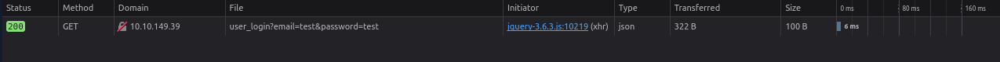
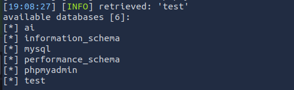
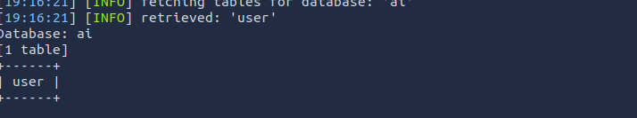
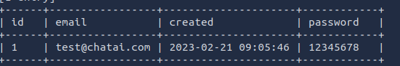

**Task 1 - Introduction**

*Q1: What language builds the interaction between a website and its database?*

A: **SQL** (Structured Query Language) is the language that builds the interactions between a website and its database respectively.

**Task 2 - SQL Injection Vulnerability**

*Q1: Which boolean operator checks if at least one sid of the operator is true for the condition to be true?*

A: The **OR** boolean operator will check if at least one side of the operator is true in order to return a true value.

*Q2: Is **1=1** in a SQL query always true? (YEA/NAY)*

A: **YES**, as with actual mathematics, 1=1 is a true value, and a computer and SQL will read it as such.

**Task 3 - Automated SQL Injection Tool**

*Q1: Which flag in the SQLMap tool is used to extract all the databases available?*

A: **--dbs** is the flag used in SQLMap that is used to extract all the databases available to the user.

*Q2: What would be the full command of SQLMap for extracting all tables from the "members" database? (Vulnerable URL: http://sqlmaptesting.thm/search/cat=1)*

A: Let's break down this command. To begin the command, we need to specify which tool we are using to the command line. This is done by inputting *sqlmap*. Next, we use the *-u* flag to specify the target URL. So far, we have: 

*sqlmap -u http://sqlmaptesting.thm/search/cat=1*

Afterwards, we use the *-D* flag followed by members to specify the database. 
Lastly, we use the *--tables* flag to extract all tables.
The command should look like the following:

*sqlmap -u http://sqlmaptesting.thm/seach/cat=1 -D members --tables*

**Task 4 - Practical Exercise**

*Q1: How many databases are available in this web application?*

A: Let's do some enumeration. Let's connect to our target machine via our web browser: 
*TARGET_IP/ai/login*

If we inspect the webpage, and enter test and test as our credentials respectively, we should be able to intercept a file over the traffic. Its a URL:

To get to our answer, we need to map out the database of our target machine using SQLMap, and the URL snippet we just intercepted: 

*sqlmap -u 'TARGET_IP/ai/includes/user_login?email=test&password=test' --dbs --level=5*

Once SQLMap runs, we should have our results:

As seen above, our answer is **6** databases.

*Q2: What is the name of the table available in the "ai" database?*

A: In order to get out answer, we simply have to modify our sqlmap command slightly. We take out the *--dbs* and replace it with *-D ai* to specify which database we want to map out.
Let sqlmap run. It should come back with one singular table: **user**

*Q3: What is the password of the email test@chatai.com?*

A: Just like before, we need to modify our command again. This time, we need to add to it. We add *-T user* to specify the table we want to dump. Then, we add *--dump* to actually dump the table, and retrieve what we are looking for. We also need to remove the *--tables* part of the command we utilized previously.

After running the command, we can see that the dump was successful, and we have our password: 

**Thank You for Reading!**
