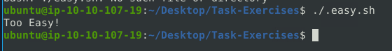

This room expects you to be familiar with basic Linux command-line functionalities like general system navigation and Network fundamentals (ports, protocols and traffic data). The room aims to encourage you to start working with Snort to analyse live and captured traffic.

Before joining this room, we suggest completing the ['Network Fundamentals'](https://tryhackme.com/module/network-fundamentals) module. If you have general knowledge of network basics and Linux fundamentals, you will be ready to begin!  If you feel you need assistance in the Linux command line, you can always  refer to our "Linux Fundamentals" rooms  (here  [1](https://tryhackme.com/room/linuxfundamentalspart1)   [2](https://tryhackme.com/room/linuxfundamentalspart2)   [3](https://tryhackme.com/room/linuxfundamentalspart3) ) ; 

SNORT is an **open-source, rule-based** Network Intrusion Detection and Prevention System **(NIDS/NIPS)** . It was developed and still maintained by Martin Roesch, open-source contributors, and the Cisco Talos team. 

**[The official description](https://www.snort.org/):** _"Snort is the foremost Open Source Intrusion Prevention System (IPS) in the world. Snort IPS uses a series of rules that help define malicious network activity and uses those rules to find packets that match against them and generate alerts for users."_

**Task 2 - Interactive Material and VM**

*Q1: Navigate to the Task-Exercises folder and run the command "./.easy.sh" and write the output*

A: Open the Linux CLI. From here, enter the command stated in the question `./.easy.sh`. It should output our answer: **Too Easy!**.

**Task 3 - Introduction to IDS/IPS**

Summary  

**Phew!** That was a long ride and lots of information. Let's summarise the overall functions of the IDS and IPS in a nutshell.

- **IDS** can identify threats but require user assistance to stop them.
- **IPS** can identify and block the threats with less user assistance at the detection time.  
    

**Now let's talk about Snort. [Here is the rest of the official description](https://www.snort.org/) of the snort;**

_"__Snort can be deployed inline to stop these packets, as well. Snort has three primary uses: As a packet sniffer like tcpdump, as a packet logger — which is useful for network traffic debugging, or it can be used as a full-blown network intrusion prevention system. Snort can be downloaded and configured for personal and business use alike."_  

SNORT is an open-source, rule-based Network Intrusion Detection and Prevention System (NIDS/NIPS). It was developed and still maintained by Martin Roesch, open-source contributors, and the Cisco Talos team. 

Capabilities of Snort;  

- Live traffic analysis
- Attack and probe detection
- Packet logging
- Protocol analysis
- Real-time alerting
- Modules & plugins
- Pre-processors
- Cross-platform support! (Linux & Windows)

Snort has three main use models;  

- Sniffer Mode - Read IP packets and prompt them in the console application.
- Packet Logger Mode - Log all IP packets (inbound and outbound) that visit the network.
- NIDS (Network Intrusion Detection System)  and NIPS (Network Intrusion Prevention System) Modes - Log/drop the packets that are deemed as malicious according to the user-defined rules.

*Q1: Which IDS or IPS type can help you stop the threats on a local machine?*

A: A **HIPS** or **Hardware Intrusion Prevention System**, can help you stop threats on a local machine. This is not to be confused with a NIPS.

*Q2: Which IDS or IPS type can help you detect threats on a local network?*

A: A **NIDS** or **Network Intrusion Detection System** can help you detect threats on a local network. The key part of this is the "N" and "D" components of the acronym, as the "N" stands for Network, and the "D" Detection.

*Q3: Which IDS or IPS type can help you detect the threats on a local machine?*

A: A **HIDS** or **Hardware Intrusion Detection System** can help you detect the threats on a local machine.

*Q4: Which IDS or IPS type can help you stop the threats on a local network?*

A: A **NIPS** or **Network Intrusion Prevention System** can help you stop the threats on a local network.

*Q5: Which described solution works by detecting anomalies in the network?*

A: The solution being described and referred to is known as a **NBA** or **Network Behavior Analysis**. It identifies anomalies in a given network and helps to detect them.

*Q6: According to the official description of the snort, what kind of NIPS is it?*

A: Scrolling up to the official description also pasted and linked in this documentation, we can see that Snort is described as a **"Full-Blown"** NIPS.

*Q7: NBA training period is also known as ...*

A: The NBA training period is also known as **Baselining**. Before an NBA can act on its own and detect anomalies in a network, it needs a baseline to compare to.

**Task 4 - First Interaction with Snort**

*Q1: Run the Snort instance and check the build number.*

A: This can be done incredibly quickly in the Linux CLI. Enter the following: `snort -V`. Once done, we can see that the Build Version is **Version 2.9.7 GRE (Build 149)**.

*Q2: Test the current instance with "/etc/snort/snort.conf" file and check how many rules are loaded with the current build.*

A: Firstly, we need to identify the configuration profile for Snort. To do this we use the `snort -c` command, followed by our specified filepath. In our case, its */etc/snort/snort.conf*. The final command will look like this: `snort -c /etc/snort/snort.conf`.

Upon executing the command, scroll up to see how many rules were loaded in via the snort.conf file. We can see that **4151** rules were loaded.

*Q3: Test the current instance with "/etc/snort/snortv2.conf" file and check how many rules are loaded with the current build.*

A: Following the same process as the previous question we can execute the following command `snort -c /etc/snort/snortv2.conf`. From here, we will scroll up a little bit once again, and we can see that there is only a singular rule this time.

**Task 6 - Operation Mode 2: Packet Logger Mode**

*Q1: Investigate the traffic with the default configuration file with ASCII mode.  

`sudo snort -dev -K ASCII -l .`

Execute the traffic generator script and choose "TASK-6 Exercise". Wait until the traffic ends, then stop the Snort instance. Now analyze the output summary and answer the question.

`sudo ./traffic-generator.sh`

Now, you should have the logs in the current directory. Navigate to folder "145.254.160.237". What is the source port used to connect port 53?*

A: To begin answering the question, start by executing the script at the beginning of the question. Open another terminal window. Run the provides script found in the *Task-Exercises* folder found on the desktop. Select option 3) which is TASK-6 Exercise. **Make sure to run it as sudo**. Upon navigating to the folder, we should see that the source port used to connect to port 53 is **3009**.

*Q2: Read the snort.log file with Snort; what is the IP ID of the 10th packet?

`snort -r snort.log.1640048004 -n 10`*

A: Run the provided command in the question. From here, we can see that the IP ID of the 10th packet is **49313**.

*Q3: Read the "**snort.log.1640048004"** file with Snort; what is the referer of the 4th packet?*

A: Run the following command in the CLI `snort -Xr snort.log.1640048004 -n 4`. This will read the fourth packet and give us what we are looking for. The referer of the 4th packet is **http://www.ethereal.com/development.html**.

*Q4: Read the "**snort.log.1640048004"** file with Snort; what is the Ack number of the 8th packet?*

A: Similar to the previous question we will enter a command into the CLI: `snort -r snort.log.1640048004 -n 8`.

Upon looking at the dump of the log, we can see the Ack number of the 8th packet is a hex value: **0x38AFFF3**.

*Q5: Read the "**snort.log.1640048004"** file with Snort; what is the number of the **"TCP port 80"** packets?*

A: This command is a little bit different from the rest. We will be utilizing the Berkeley Packet Filter to retrieve our answer. This will be done at the end of our CLI command. 
Input the following into the CLI: `snort -r snort.log.1640048004 'tcp port 80'`

Once run, we will see that **41** packets were received and analyzed.

**Task 7 - Operation Mode 3: IDS/IPS**

*Q1: Investigate the traffic with the default configuration file.  

`sudo snort -c /etc/snort/snort.conf -A full -l .`

Execute the traffic generator script and choose **"TASK-7 Exercise"**. Wait until the traffic stops, then stop the Snort instance. Now analyse the output summary and answer the question.

`sudo ./traffic-generator.sh`

What is the number of the detected HTTP GET methods?*

A: Load the scripts similar to the previous task. From there, we will run snort. We should see that **2** HTTP GET methods were detected.

**Task 8 - Operation Mode 4: PCAP Investigation**

*Q1: Investigate the **mx-1.pcap** file with the default configuration file.  

`sudo snort -c /etc/snort/snort.conf -A full -l . -r mx-1.pcap`

What is the number of the generated alerts?*

A: Upon changing directories to *TASK-8*, run the command provided in the CLI. Scroll up a tad, and we will see that there were **170** alerts generated.

*Q2: Keep reading the output. How many TCP Segments are Queued?*

A: Continuing to read the output by scrolling down, we see a section regarding Stream statistics. This will tell us how many TCP Segments were queued. We can see that there 18 segments queued.

*Q3: Keep reading the output. How many "HTTP response headers" were extracted?*

A: Moving forward and scrolling down to the "HTTP Inspect" section, we can see that there were **3** HTTP Response Headers extracted.

*Q4: Investigate the mx-1.pcap file **with the second** configuration file.  

`sudo snort -c /etc/snort/snortv2.conf -A full -l . -r mx-1.pcap`

What is the number of the generated alerts?*

A: Same as the first question in this task, we will run the command provided to us. Going to the "Action Stats" section of the log, we can see that **68** alerts were generated.

*Q5: Investigate the **mx-2.pcap** file with the default configuration file.  

`sudo snort -c /etc/snort/snort.conf -A full -l . -r mx-2.pcap`

What is the number of the generated alerts?*

A: Once again, run the command provided. We will see that there were **340** alerts generated.

*Q6: Keep reading the output. What is the number of the detected TCP packets?*

A: Scrolling down a little bit to the "Breakdown by Protocol" section, we can see that TCP protocol had **82** packets detected.

*Q6: Investigate the mx-2.pcap and mx-3.pcap files with the default configuration file.  

`sudo snort -c /etc/snort/snort.conf -A full -l . --pcap-list="mx-2.pcap mx-3.pcap"`

What is the number of the generated alerts?*

A: One last time, run the command in the CLI that was provided. Scrolling down to the "Action Stats" section, we see that **1020** alerts were generated between the two pcap files.

**Task 9 - Snort Rule Structure**

*Q1: Use "task9.pcap". Write a rule to filter IP ID "35369" and run it against the given pcap file. What is the request name of the detected packet? You may use this command: "`snort -c local.rules -A full -l . -r task9.pcap"`*

A: On the desktop, open the *Task-Exercises* folder. Once there, open the *local.rules* file in a text editor. Enter the following as a rule in the text file: `alert icmp any any <> any any (msg: "ICMP Packet Found";id:35369;sid100001;)`. Save the file. 

We can now run the command provided in the question. Do this in the CLI. Once completed, open the *alert* file in a text editor. Scroll to the most recent alert. You will now see that there was a **TIMESTAMP REQUEST** for the detected packets through Snort.

*Q2: Clear the previous alert file and comment out the old rules. Create a rule to filter packets with **Syn** flag and run it against the given pcap file. What is the number of detected packets?*

A: To comment out a rule, use the "#" sign prior to the rule the line is on. This will comment it out, meaning the computer will not process the rule. In the *local.rules* file, enter the following rule on the next line: `alert tcp any any <> any any (msg: "FLAG TEST";flags:S;sid:100002;)`. Run this on the CLI.

Once done, open the alert file, and you will see it is updated with new alerts. You should see that Snort only processed **1** packet.

*Q3: Clear the previous alert file and comment out the old rules. Write a rule to filter packets with **Push-Ack** flags and run it against the given pcap file. What is the number of detected packets?*

A: Like the previous question, comment out our old rule. From here, create a new rule: `alert tcp any any <> any any (msg: "Flag Push-Ack Test";flags:P,A;sid:100003)`.

Run our command as provided previously in the CLI. Let's check our *alert* file. The output should tell us there were **216** detected packets.

*Q4: Clear the previous alert file and comment out the old rules. Create a rule to filter **UDP** packets with the same source and destination IP and run it against the given pcap file. What is the number of packets that show the same source and destination address?*

A: Similar to last time, we need to write a new rule. Comment out the old one once again. Now write the following rule: `alert ip any any <> any any (msg:"Same IP";sameip;sid:100004;)`. Clear the alert file, and run the command in the CLI. This will generate our answer in the *alert* file.
After checking the total, we see that it is **7**.

*Q5: Case Example - An analyst modified an existing rule successfully. Which rule option must the analyst change after the implementation?*

A: The answer to this question can be found further above in the "General Rule Options" section of the room. The answer is **rev**.

**Thank you for Reading!**

