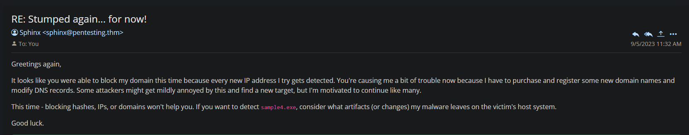
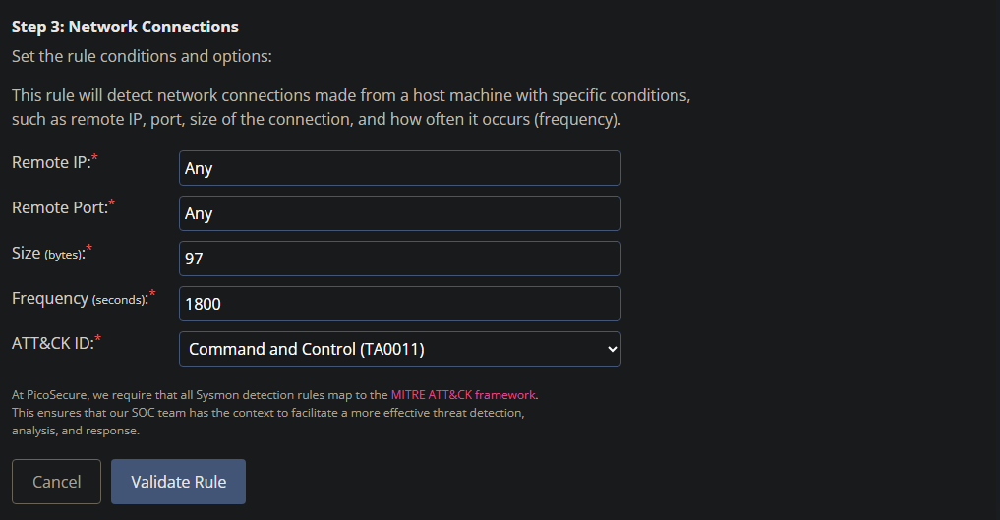

**The lab being documented is available on [Tryhackme]([tryhackme.com/room/summit)**

**Task 1 - Challenge**

To begin the task, let's boot up our VM. This will take about a minute. Open the link provided.

*Q1: What is the first flag you recieve after successfully detecting **sample1.exe**?*

A: Once inside the machine simulation, we see that there is an email with a file attachment called sample1.exe. Scan this file with the malware sandbox by clicking it. This will take you to the upload sample page.

Allow the sample to be process. After analysis, Metasploit was detected. We need to create a rule to block this application from being able to be executed.

Open the hamburger menu in the top left. Go to the **Manage Hashes** option. Once there, copy the MD5 hash from sample1.exe, and block it. We should now have an email with our flag.

*Q2: What is the second flag you receive after successfully detecting **sample2.exe**?*

We received a second executable file. Let's return to the malware sandbox and scan it.

A: As seen in the above image of our analysis, we can see it has a very similar behavior, but a different hash. Our rule created in the previous question will not work for this executable. Notice on the bottom there are HTTP(S) requests. We can use this to our advantage. Open the hamburger menu in the top left again, this time going to **Firewall Rules**.

From here, we declare that it is an outgoing request from our network. Our source IP should be declared as 'Any', as this is malware and should be prevented across our network. The destination IP should be set from the connections established in the bottom of our sandbox image. Copy and paste that IP address. The action will be **Deny**.

This did the trick! We have a new email.

*Q3: What is the third flag you receive after successfully detecting **sample3.exe**?*

The last email sent gave us a hint. Let's open the hamburger menu once again and go to **DNS Rule Manager**.

A:  In a second tab, open the malware sandbox for sample3.exe. We can see at the bottom there are DNS requests. Let's create a rule to block the domain entirely. Call the rule something identifiable. Personally, I did "Block Malware Communication". The category is malware, and the domain name as seen in the sandbox image below. The action is **Deny**. Save the rule, and we should have a new email!

*Q4: What is the fourth flag you receive after successfully detecting **sample4.exe**?*

Time to analyze the next sample. Run the analysis on sample4.exe. We see a new category of activities occurring: **Registry Activity**.

A: To begin creating this rule, we are going to the final option in the hamburger menu on the top left: **Sigma Rule Builder**. Since we are trying to block registry modification, we will select **Sysmon Event Logs**. This will look for system monitor events.

Next, we need to filter our Sysmon Event Logs for **Registry Modifications**. This is found in step 2.

Fill out the fields as seen above. Let's do one together. 
The registry key is found in our initial malware analysis for example4.exe. It is HKEY_LOCAL_MACHINE\SOFTWARE\Microsoft\Windows Defender\Real-Time Protection.
The registry name is found right below it, and it is called DisableRaltimeMonitoring. 
The value is found on the left column, and is 1.
Lastly, the ATT&CK ID would be Defense Evasion (TA0005), as the registry being modified is regarding Windows Defender.

Upon rule validation, we have a new email!

*Q5: What is the fifth flag you receive after successfully detecting sample5.exe?*

To begin tackling this challenge, let's run sample5.exe in the Malware Sandbox. We see many connections being processed.

We also have the log attached in our email. Let's take a peek.

Notice how the traffic is on ports 80, and 443. These are HTTP and HTTPS protocol ports respectively. Let's get to the rules.

A: Open the tab with the **Sigma Rule Builder**. This time, we are going to use the **Sysmon Event Logs** function, with out step 2 differing. We are going to select **Network Connections** in step 2.

As seen in the image above, the Remote IP will be set to "Any", as the attacker has evolved, and the request could be sent from any IP potentially. As for the remote port, there are many ports the attacker COULD use, so we set this to "Any". Referring to the log file, we notice the beacon c2 request is 97 bytes in size. Set it to this. The frequency is also half an hour, which is 1800 seconds. Once done, we should have another email.

*Q6: What is the final flag you receive from Sphinx?*

As always to start, let's submit example6.exe for analysis.

Upon analysis, we find some interesting information: processes. In particular, cmd.exe.
Let's go to **Sigma Rule Builder**.

A: Once in Sigma Rule Builder, we will be doing another Sysmon Event Log rule. This time, in step 2, we will be using the **Process Creation** function.

As seen in the image above, we have some information to fill in. Let's get to it.
The process name we are looking for was seen in our analysis: **cmd.exe**.
There is only one option for CommandLine, and that is **Contains**.
The string value we are looking for is found in the logs attached in the email. See the image below.
Our ATT&CK ID is Exfiltrate, as referenced by the string.

We should now have our final flag! Congrats!

**Thanks for Reading!**
