This room will cover the concepts of Threat Intelligence and various open-source tools that are useful. The learning objectives include:

- Understanding the basics of threat intelligence & its classifications.
- Using UrlScan.io to scan for malicious URLs.
- Using Abuse.ch to track malware and botnet indicators.
- Investigate phishing emails using PhishTool
- Using Cisco's Talos Intelligence platform for intel gathering.

To mitigate against risks, we can start by trying to answer a few simple questions:

- Who's attacking you?
- What's their motivation?
- What are their capabilities?
- What artefacts and indicators of compromise should you look out for?

### Threat Intelligence Classifications:

Threat Intel is geared towards understanding the relationship between your operational environment and your adversary. With this in mind, we can break down threat intel into the following classifications: 

- **Strategic Intel:** High-level intel that looks into the organisation's threat landscape and maps out the risk areas based on trends, patterns and emerging threats that may impact business decisions.
- **Technical Intel:** Looks into evidence and artefacts of attack used by an adversary. Incident Response teams can use this intel to create a baseline attack surface to analyse and develop defence mechanisms.
- **Tactical Intel:** Assesses adversaries' tactics, techniques, and procedures (TTPs). This intel can strengthen security controls and address vulnerabilities through real-time investigations.
- **Operational Intel:** Looks into an adversary's specific motives and intent to perform an attack. Security teams may use this intel to understand the critical assets available in the organisation (people, processes, and technologies) that may be targeted.

**Task 3 - URLScan.io**

*Q1: What was TryHackMe's Cisco Umbrella Rank based on the screenshot?*

A: Based on the screenshot provided, we can see that TryHackMe.com's Cisco Umbrella Rank is **345612**. See the image below.

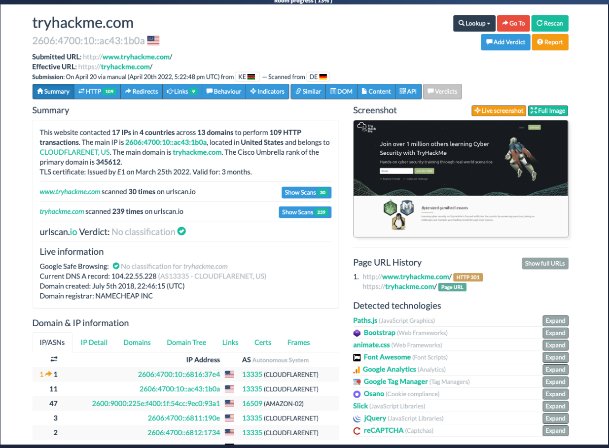

*Q2: How many domains did UrlScan.io identify on the screenshot?*

A: Also according to the screenshot seen above, we can see that the website contacted 17 IPs in 4 countries, across **13 Domains**.

*Q3: What was the main domain registrar listed on the screenshot?*

A: The main domain registrar can also be identified in the screengrab. It is **NAMECHEAP INC**.

*Q4: What was the main IP address identified for TryHackMe on the screenshot?*

A: Once again seen in the screengrab, the main IP address of TryHackMe is **2606:4700:10::ac43:1b0a**.

**Task 4 - Abuse.ch**

*Q1: The IOC **212.192.246.30:5555** is identified under which malware alias name on ThreatFox?*

A: Upon submitting the query *ioc:212.192.246.30:5555*, we see our results in ThreatFox. If we click on the malware, Mirai, we will see that the Malware Alias is **Katana**. See the images below.

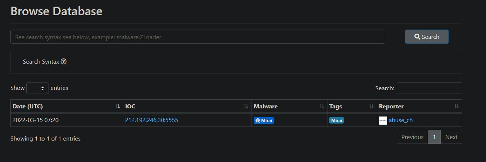

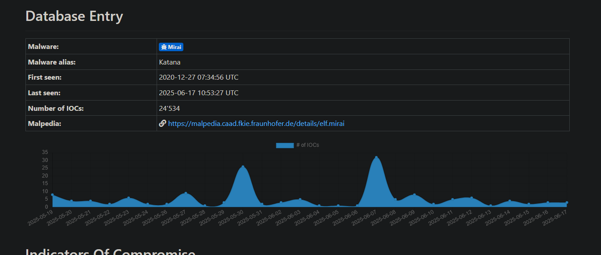

*Q2: Which malware is associated with the JA3 Fingerprint **51c64c77e60f3980eea90869b68c58a8** on SSL Blacklist?*

A: Upon going to the SSL Blacklist website, we see in the top right that we can switch to search for JA3 Fingerprints. Let's go there and search.

Upon inputting our JA3 fingerprint in the search bar, one result returns. It is associated with **Dridex** malware.

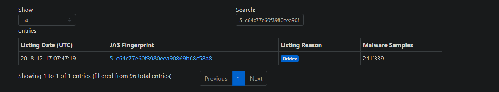

*Q4: From the statistics page on URLHaus, what malware-hosting network has the ASN number **AS14061**?*

A: Upon arrived at URLHaus, we see an Access Data drop down list of directories. Go to statistics. We are going to search the webpage for our ASN.

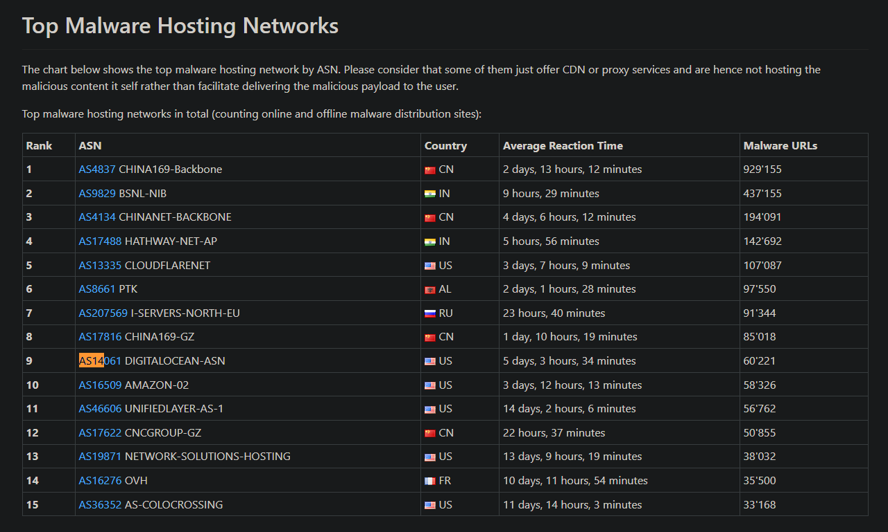

Upon finding our ASN, we see that **DIGITALOCEAN-ASN** is the ASN associated with the provided ASN number.

*Q4: Which country is the botnet IP address **178.134.47.166** associated with according to FeodoTracker?*

A: Arriving at FeodoTracker, we need to search IP addresses. This is down via the browse page. Insert our IP in the search bar, and it will return a result.

It is a Silknet network originating from the country of **Georgia**.

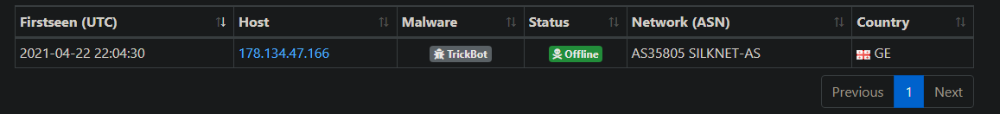

**Task 5 - PhishTool**

*Q1: What social media platform is the attacker trying to pose as in the email?*

A: Upon opening PhistTool via ThunderBird Mail, we see that the first email is attempting to imitate the popular social media platform **LinkedIn**.

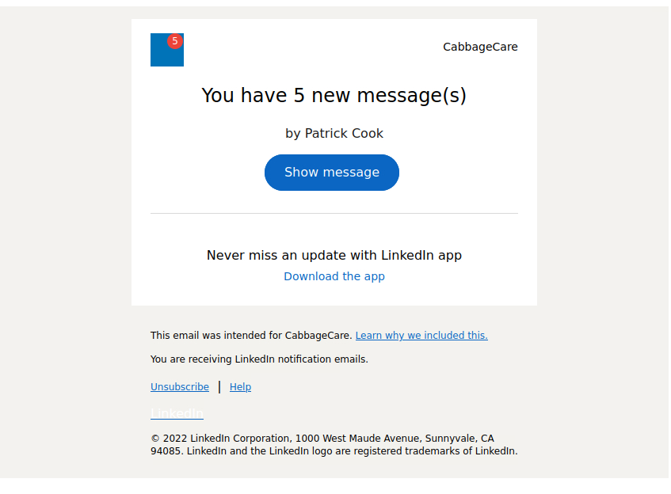

*Q2: What is the senders email address?*

A: Seen at the top of the email, we can see that the sender's email address is **darkabutla@sc500.whpservers.com**.

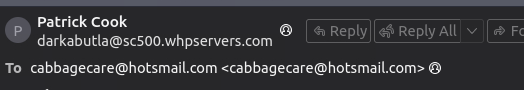

*Q3: What is the recipient's email address?*

A: As seen in the screenshot above, the recipient's email address is **cabbagecare@hotsmail.com**.

*Q4: What is the Originating IP address? Defang the IP address.*

A: On line 17 if we open up the email file in a txt editor such as Pluma, we can see that the originating IP address is **204[.]93[.]183[.]11**. This is the defanged version.

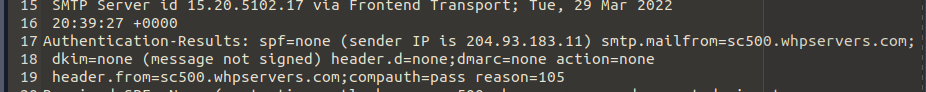

*Q5: How many hops did the email go through to get to the recipient?*

A: Prior to our authentication on line 17, we can see that the email hopped **4** times. This is seen by the amount of lines that begin with the term "recieved" before the Authentication-Results.

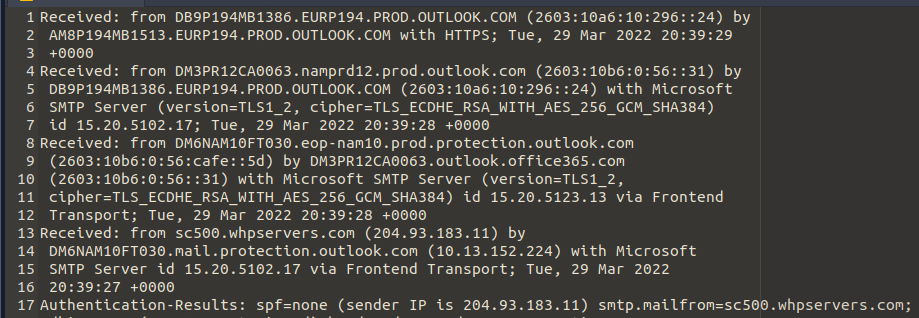

**Task 6 - Cisco Talos Intelligence**

*Q1: What is the listed domain of the IP address from the previous task?*

A: Upon arriving at the talos intelligence website, we will search for the IP address we found in the previous task. Upon receiving our results, we see that **scnet.net** is the listed domain.

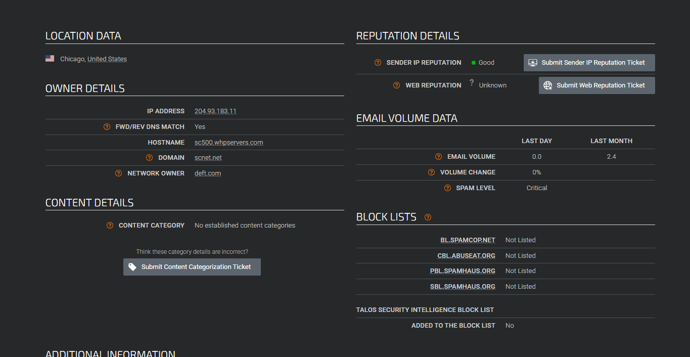

*Q2: What is the customer name of the IP address?*

A: For some reason Talos Intelligence, could not perform the WHOIS query. I went elsewhere and received that information at this [link](https://www.whois.com/whois/204.93.183.11). We see that the customer is **Complete Web Reviews**. 

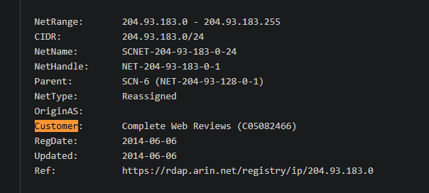

**Task 7 - Scenario 1**

**Scenario****:** You are a SOC Analyst. Several suspicious emails have been forwarded to you from other coworkers. You must obtain details from each email to triage the incidents reported.

*Q1: According to **Email2.eml**, what is the recipient's email address?*

A: Upon opening email2.eml in thunderbird mail, we see that the recipients email address is **chris.lyons@supercarcenterdetroit.com**.

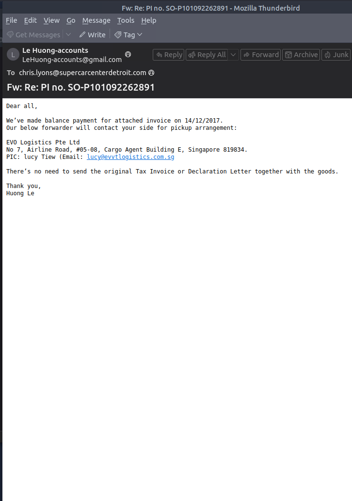

*Q2: On VirusTotal, the attached file can also be identified by a Detection Alias, which starts with an **H.***

A: 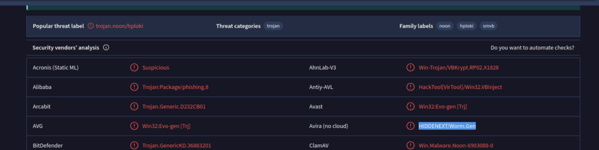

As seen by the highlighted text in the screengrab above, the name of the alias we are looking for is **hiddenext/worm.gen**.

**Task 8 - Scenario 2**

Scenario: You are a SOC Analyst. Several suspicious emails have been forwarded to you from other coworkers. You must obtain details from each email to triage the incidents reported.   

Task: Use the tools and knowledge discussed throughout this room (or use your resources) to help you analyze **Email3.eml** found on the VM attached to **Task 5** and use the information to answer the questions.

*Q1: What is the name of the attachment on Email3.eml?*

A: As we can see from the screenshot below, there is an attachment at the bottom of the email. It is called **Sales_Receipt 5606.xls**.

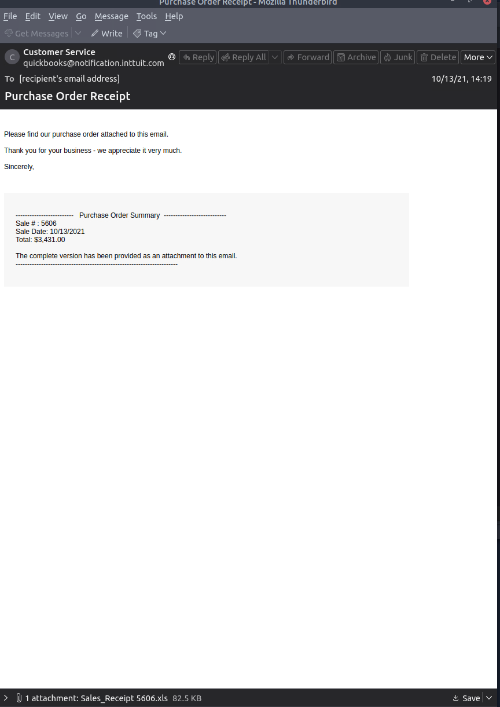

*Q2: What malware family is associated with the attachment on Email3.eml?*

A: The malware family associated with the email attachment is **Dridex**. This conclusion can be come to by running the attachment in virustotal. It identifies the file as a Trojan, but has some useful tags.

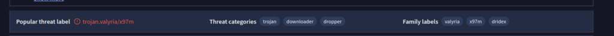

We can also look up the sha256 hash of file on a website such as malware bazaar, and it will identify the hash as Dridex malware.

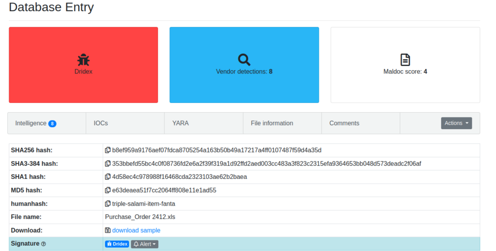

**Thanks for Reading!**