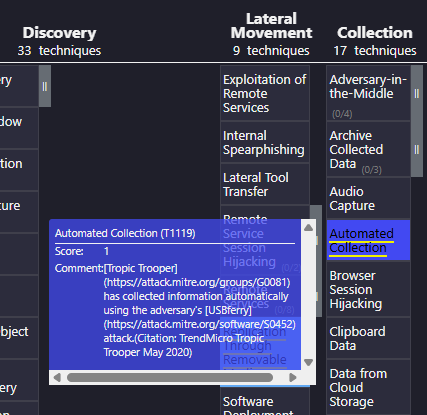

A multinational technology company has been the target of several cyber attacks in the past few months. The attackers have been successful in stealing sensitive intellectual property and causing disruptions to the company's operations. A [threat advisory report](https://assets.tryhackme.com/additional/trooper-cti/APT_X_USBFerry.pdf) about similar attacks has been shared, and as a CTI analyst, your task is to identify the Tactics, Techniques, and Procedures (TTPs) being used by the Threat group and gather as much information as possible about their identity and motive. For this task, you will utilize the [OpenCTI](https://tryhackme.com/room/opencti) platform as well as the MITRE ATT&CK navigator, linked to the details below.

*Q1: What kind of phishing campaign does APT X use as part of their TTPs?*

A: APT X utilizes **Spear-phishing emails** as a phishing campaign targeting specific people/companies as part of their TTPs. This can be read in the first paragraph of the report presented in the task on [TryHackMe](https://tryhackme.com/room/trooper).

*Q2: What is the name of the malware used by APT X?*

A: APT uses a piece of malware called **USBferry**. It employs different controls based on the specific target and maintains stealth in environments. It will steal critical and classified data through USB storage. More details can be found in the link above via the report in the TryHackMe room.

*Q3: What is the malware's STIX ID?*

A: Open our VM and connect to the machine running the OpenCTI platform. The information is displayed in the room to login and get connected.

After this is completed, we are going to go to the "Arsenal" section on the left and search for our malware: USBferry.

Once there, we see the Standard STIX ID we are looking for.

*Q4: With the use of a USB, what technique did APT X use for initial access?*

A: Scrolling down in the OpenCTI report, we can see the latest created relationships. Through here, we notice a specific attack pattern regarding removable USB devices: **Replication Through Removable Media**.

*Q5: What is the identity of APT X?*

A: The identity of APT X is **Tropic Trooper**. It is an unaffiliated threat group that leads targeted campaigns against targets in Asia, specifically Taiwan, the Philippines, and Hong Kong.
[via MITRE ATT&CK](https://attack.mitre.org/groups/G0081/)

*Q6: On OpenCTI, how many Attack Pattern techniques are associated with the APT?*

A: Referring back to the [MITRE ATT&CK](https://attack.mitre.org/groups/G0081/) page, we can see that there are **39** unique attack pattern techniques, including sub-techniques. 

*Q7: What is the name of the tool linked to the APT?*

A: Once again referring to the [MITRE ATT&CK](https://attack.mitre.org/software/S0190/) page for Tropic Trooper, we can see that **BITSAdmin** is a tool linked to our APT.

*Q8: Load up the Navigator. What is the sub-technique used by the APT under Valid Accounts?*

A: Opening up the navigator, we will search for the "Valid Accounts" technique. From there, we can look at its respective sub-techniques. We see that one of the sub-techniques is used by Topic Trooper: **Local Accounts**.

*Q9: Under what Tactics does the technique above fall?*

A: Upon our discovery, we can return to its respective [MITRE ATT&CK](https://attack.mitre.org/techniques/T1078/003/) sub-technique page. From here, we can see what tactics the technique falls into. 
It falls into the following:

*Q10: What technique is the group known for using under the tactic Collection?*

A: Going back to the [ATT&CK Naviagator](https://mitre-attack.github.io/attack-navigator//#layerURL=https%3A%2F%2Fattack.mitre.org%2Fgroups%2FG0081%2FG0081-enterprise-layer.json) and scrolling to the left, under the collection tactic, we can see that one is used by Tropic Trooper: **Automated Collection**.

**Thanks for Reading!**