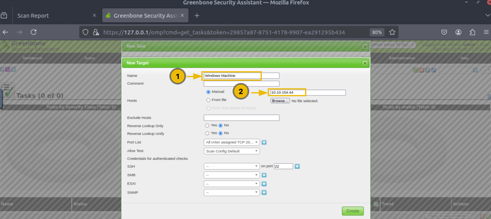
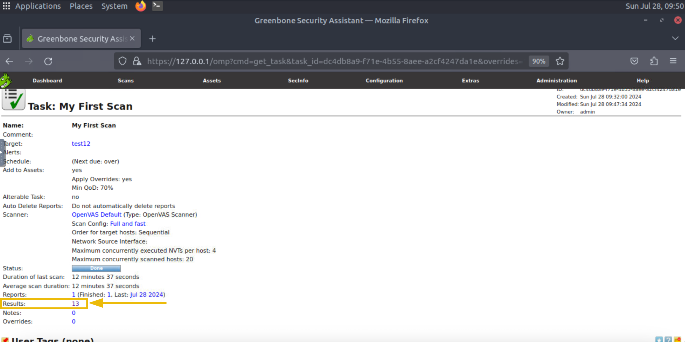
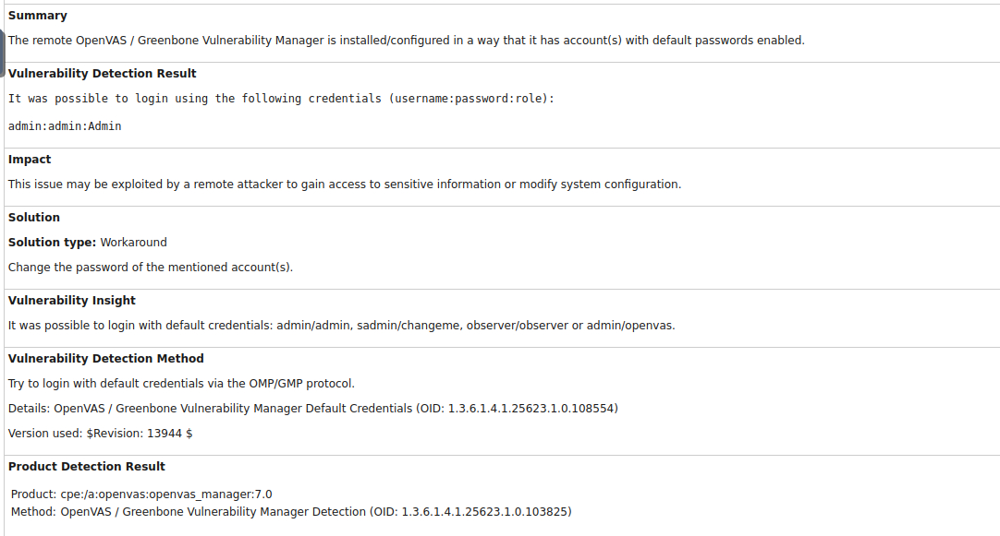

**Task 1 - What are Vulnerabilities?**

*Q1: What is the process of fixing a vulnerability called?*

A: The process of fixing a vulnerability and deploying the update is referred to as **Patching**.

**Task 2 - Vulnerability Scanning**

*Q1: Which type of vulnerability scans require the credentials of the target host?*

A: **Authenticated** scans require the credentials of the target host in order to process with the vulnerability scan.

*Q2: Which type of vulnerability scan focuses on identifying the vulnerabilities that can be exploited from outside the network?*

A: An **External** scan focuses on identifying vulnerabilities than can be targeted and exploited from outside a network.

**Task 3 - Tools for Vulnerability Scanning**

*Q1: Is Nessus currently an open-source vulnerability scanner? (Yes/Nay)*

A: **No**, Nessus is not currently an open-source vulnerability scanner. Although Nessus was initially an open-source application, that changed in 2005 when it was acquired by Tenable and became proprietary software.

*Q2: Which company developed the Nexpose vulnerability scanner?*

A: **Rapid7** developed Nexpose in 2005. It is a subscription-based vulnerability management solution.

*Q3: What is the name of the open-source vulnerability scanner developed by Greenbone Security?*

A: **OpenVAS** is an open-source vulnerability scanner, and was developed by Greenbone Security.

**Task 4 - CVE & CVSS**

*Q1: What does CVE stand for?*

A: CVE stands for **Common Vulnerabilities and Exposures**. There is a database for all known CVEs.

*Q2: Which organization developed CVE?*

A: **MITRE Corporation** developed the CVE. 

*Q3: What would be the severity level of the vulnerability with a score of 5.3?*

A: A vulnerability with a severity score of 5.3 would be considered a **medium** severity vulnerability.

**Task 5 - OpenVAS**

*Q1: What is the IP address of the machine scanned in this task?*

A: **10.10.154.44** is the IP address of the machine scanned in the task. This can be seen in the third figure of the task, as well as below.

*Q2: How many vulnerabilities were discovered on this host?*

A: **13** vulnerabilities were discovered on the host. This can be seen in the second to last image of the task, or in the image below:

**Task 5 - Practical Exercise**

*Q1: What is the score of the single high-severity vulnerability found in the scan?*

A: The score of the only high-severity vulnerability found in the scan is **10**. It is due to having default credentials.

*Q2: What is the solution suggested by OpenVAS for this vulnerability?*

A: OpenVAS suggests **changing the password of the mentioned account(s)**. The full report for the high-severity vulnerability by OpenVAS can be seen below:

**Thank you for reading!**