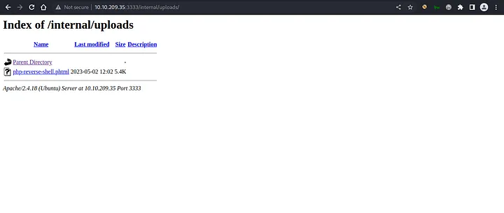

Task 1 - Deploy the Machine

Notes - Began AttackBox via TryHackMe. Spun up machine for the exercise.

Task 2 - Reconnaissance

Question 1) There are many Nmap "cheatsheets" online that you can use too.

Make Use of the provided nmap cheatsheet. This is a brief list of commands and arguments that can be used in the terminal to invoke nmap.

Question 2) Scan the box; how many ports are open?

Begin by opening the terminal and entering the following on the target machine: 
nmap -sC -sV - v 10.10.247.141 

Upon running the command, we can see that there is 6 ports currently open on the machine.

Question 3) What version of the squid proxy is running on the machine?

For the answer to this question, all we need to do is look in the details of the nmap scan we did earlier. 

We can see that squid proxy is running on the machine, on port 3128, and is using version 3.5.12.

Question 4) How many ports will Nmap scan if the flag -p-400 was used?

The answer is in the question itself. The flag -p-400 indicates to nmap to only scan the first 400 ports. Therefore, the answer is 400.

Question 5) What is the most likely Operating System this machine is running?

The actual answer is in our nmap scans, but we can assume that this machine is running some form of Linux. Servers most commonly run Linux, so its a safe guess. We can also check with nmap with the -O flag. My flag for whatever reason found no exact OS matches, but after trial and error, Ubuntu is the answer, and one of the more common Linux distributions out there. It can also be seen with the next question's information.

Question 6) What port is the web server running on?

The port the web server is running on is port 3333. As seen above, an apache server running on Ubuntu is running on port 3333.

Question 8) What is the flag for enabling verbose mode using Nmap?

-v is the flag, as seen in the table provided.

Task 3 - Locating directories using Gobuster

Question 1) Configure Gobuster

TryHackMe notes below. Using attackbox, it is preconfigured.

Question 2) What is the directory that has an upload form page?

After running the below command, we can see our results: 

We see that there is a path on the appache server called /internal/. This is out answer.

Task 4 - Compromise the Webserver

Question 1) What common file type do you want to upload to exploit the server is blocked? Try a couple to find out.

PHP is a backend languages a majority of webservers will use. Utilizing a .php file will allow us to exploit any vulnerabilities in the webserver.

Question 2) What extension is allowed after running the above exercise?

.phtml

In Burp Suite, we catch the traffic of the uploading file, and send it to the intruder.

Now, we mark the .php part in intruder, and click add.

Next, we are going to move to the payloads tab, and add the following payloads through a text file. 

Question 3) What is the name of the user who manages the webserver?

First, we need to download the reverse shell. THen, change the IP address to our tunnel at tun0, and change the port to 1234, which is where we will be listening.

Next, we upload our payload to the website. This can be done @ targetIP:3333/internals/uploads

Now, we have to make the aforementioned listener. This is as simple as launching netcat with the following command:  nc -lvnp 1234. 1234 is the port we will be listening on, and the reason we had to modify our payload.

Now, we navigate to our upload and execute it to see if we have our reverse shell.

It looks like we do have a shell! From here we can just look at the home directory, and see that the user we are looking for is bill.

Question 4) What is the user flag?

To get this, it is relatively simple.
We must switch to the bill user with cd bill.
Then, see all files with ls.
We can see that there is a file called user.txt. To read this, we will use the command cat user.txt.
We will see the following flag:  

Task 5 - Privilege Escalation

Question 1)  On the system, search for all SUID files. Which file stands out?

To do this, we need to find the SUID files. We can do this by executing the following command in  the reverse shell: **_find / -perm -u=s -exec ls -l {} \; 2>/dev/null_**
After the execution of the command, wwe can see /bin/systemctl. This is how we will achieve superuser (root)

Question 2) What is the root flag value?

This part is relatively easy. We just need to get into the /bin/systemctl directory. This is where user passwords are most commonly stored on linux. Simply, we need to read the root.txt file. 

All Done! Congrats!