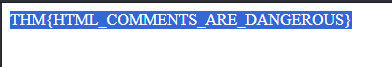
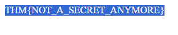
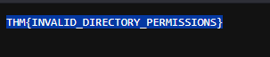
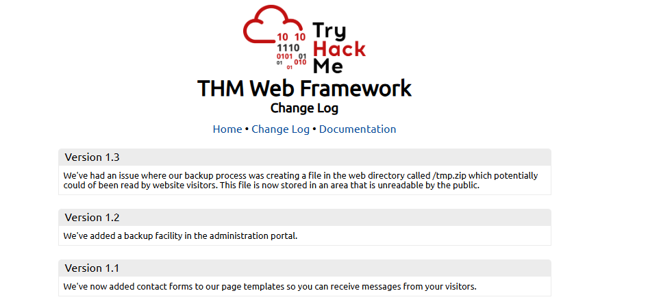
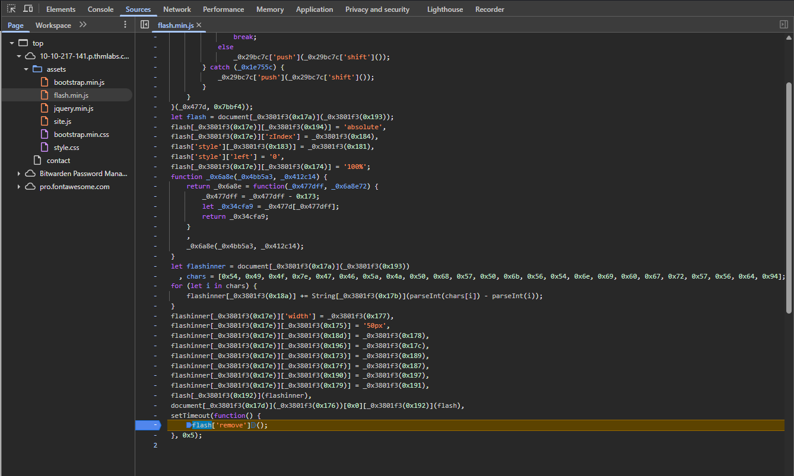
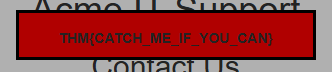
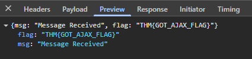

In this room you will learn how to manually review a web application for security issues using only the in-built tools in your browser. More often than not, automated security tools and scripts will miss many potential vulnerabilities and useful information.

  

Here is a short breakdown of the in-built browser tools you will use throughout this room:

- **View Source** - Use your browser to view the human-readable source code of a website.
- **Inspector** - Learn how to inspect page elements and make changes to view usually blocked content.
- **Debugger** - Inspect and control the flow of a page's JavaScript
- **Network** - See all the network requests a page makes.

Press the "Start Machine" button to start the virtual machine on this task, then **wait 2 minutes**, and visit the following URL: [https://LAB_WEB_URL.p.thmlabs.com](https://lab_web_url.p.thmlabs.com/) _(this URL will update 2 minutes from when you start the machine)_

Finding interactive portions of the website can be as easy as spotting a login form to manually reviewing the website's JavaScript. An excellent place to start is just with your browser exploring the website and noting down the individual pages/areas/features with a summary for each one.

An example site review for the Acme IT Support website would look something like this:

|   |   |   |
|---|---|---|
|**Feature**|**URL**|**Summary**|
|Home Page|/|This page contains a summary of what Acme IT Support does with a company photo of their staff.|
|Latest News|/news|This page contains a list of recently published news articles by the company, and each news article has a link with an id number, i.e. /news/article?id=1|
|News Article|/news/article?id=1|Displays the individual news article. Some articles seem to be blocked and reserved for premium customers only.|
|Contact Page|/contact|This page contains a form for customers to contact the company. It contains name, email and message input fields and a send button.|
|Customers|/customers|This link redirects to /customers/login.|
|Customer Login|/customers/login|This page contains a login form with username and password fields.|
|Customer Signup|/customers/signup|This page contains a user-signup form that consists of a username, email, password and password confirmation input fields.|
|Customer Reset Password|/customers/reset|Password reset form with an email address input field.|
|Customer Dashboard|/customers|This page contains a list of the user's tickets submitted to the IT support company and a "Create Ticket" button.|
|Create Ticket|/customers/ticket/new|This page contains a form with a textbox for entering the IT issue and a file upload option to create an IT support ticket.|
|Customer Account|/customers/account|This page allows the user to edit their username, email and password.|
|Customer Logout|/customers/logout|This link logs the user out of the customer area.|

We will start taking a deeper look into some of the pages we have discovered in the next task.

**Task 3 - Viewing the Page Source**

*Q1: What is the flag from the HTML comment?*

A: Looking at the HTML source page of the lab, we can see a comment right at the top of the page. It says that the page we just viewed is a temporary homepage, and there is a new one being constructed at the directory */new-home-beta*. Upon going there, we see our first flag:

*Q2: What is the flag from the secret link?*

A: Once again looking at the HTML source page, on line 41 of the HTML, we see a ref to a "secret page" directory. Clicking the link or going to */secret-page* will get us another flag:

*Q3: What is the directory listing flag?*

A: On line 13 of the HTML, we notice that there is an "assets" directory. We can modify the end of our URL and put */assets* at the end to go to the file directory of the website due to a misconfiguration. Click "flag.txt" This will get us yet another flag:

*Q4: What is the framework flag?*

A: Upon looking around a little bit, on the bottom of the HTML code, we find a comment with a link to the site's framework. From there, we can see the changelog.

In version 1.3, we can see that it makes a directory called */tmp.zip*. We can go to this directory and download the flag!

**Task 4 - Developer Tools: Inspector**

*Q1: What is the flag behind the paywall?*

A: Open the *news/article* page. From here, you will get a popup block that says you need to be a premium user. We can bypass this by modifying the source page HTML. Inspect the element, and then change the `display: block;` option to `display: none;`.

It should look something like this and the flag is there.

**Task 5 - Developer Tools: Debugger**

*Q1: What is the flag in the red box?*

A: Go to the */contact* directory. From here, inspect the webpage, and navigate over to the "Sources" tab of the inspector. Now, you should see the assets tab on the left hand side. From here, we click on the "flash.min.js" file. It should look something like this.

From there, click the number of the line that contains the code `flash['remove']();`. This creates what is called a breakpoint. Refresh the page, and we should now see the flag:

**Task 6 - Developer Tools: Network**

*Q1: What is the flag shown on the contact-msg network request?*

A: Still in the */contact* directory, go to the network tab of the inspector. Submit any sort of text into the contact fields and submit it. From there, go to the "preview" tab of the network section. 

