Introduction  

This room will expect you to understand basic Linux familiarity, such as installing software and commands for general navigation of the system. Moreso, this room isn't designed to test your knowledge or for point-scoring. It is here to encourage you to follow along and experiment with what you have learned here.  

  

As always, I hope you take a few things away from this room, namely, the wonder that Yara (_Yet Another Ridiculous Acronym_) is and its importance in infosec today. Yara was developed by Victor M. Alvarez ([@plusvic](https://twitter.com/plusvic)) and [@VirusTotal](https://twitter.com/virustotal). Check the GitHub repo [here](https://github.com/virustotal/yara).

**Task 2 - What is Yara?**

*Q1: What is the name of the base-16 numbering system that Yara can detect?*

A: **Hexadecimal**, or simply referred to as hex, is the name of the base-16 numbering system Yara detects.

*Q2: Would the text "Enter your Name" be a string in an application? (Yay/Nay)*

A: The text "Enter your Name" **Is a String**, thus our answer is **Yay**.

**Task 3 - Deploy**

Deploy your own instance by pressing the green "Start Machine" button and scroll up to the top of the room and await the timer. The machine will start in a split-screen view. In case the VM is not visible, use the blue "Show Split View" button at the top-right of the page.

**Task 4 - Introduction to Yara Rules**

Using a Yara rule is simple. Every yara command requires two arguments to be valid, these are:
1) The rule file we create
2) Name of file, directory, or process ID to use the rule for.

Every rule must have a name and condition. For example, if we wanted to use "myrule.yar" on directory "some directory", we would use the following command:
yara myrule.yar somedirectory

Note that .yar is the standard file extension for all Yara rules. We'll make one of the most basic rules you can make below.

**Expanding on Yara Rules**

See the infographic below. I find it extremely useful.

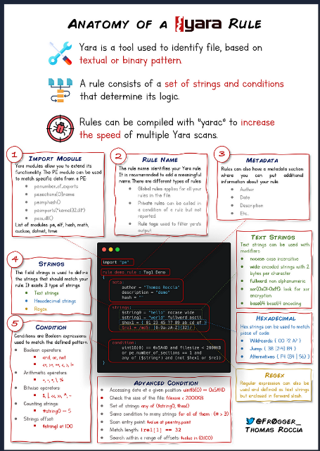

**Task 6 - Yara Modules**

Via TryHackMe:

Integrating With Other Libraries
Frameworks such as the Cuckoo Sandbox or Python's PE Module allow you to improve the technicality of your Yara rules ten-fold.

Cuckoo
Cuckoo Sandbox is an automated malware analysis environment. This module allows you to generate Yara rules based upon the behaviours discovered from Cuckoo Sandbox. As this environment executes malware, you can create rules on specific behaviours such as runtime strings and the like.

Python PE
Python's PE module allows you to create Yara rules from the various sections and elements of the Windows Portable Executable (PE) structure.

Explaining this structure is out of scope as it is covered in my malware introductory room. However, this structure is the standard formatting of all executables and DLL files on windows. Including the programming libraries that are used. 

Examining a PE file's contents is an essential technique in malware analysis; this is because behaviours such as cryptography or worming can be largely identified without reverse engineering or execution of the sample.

**Task 7 - Other Tools and Yara**

There are many tools made for use with Yara. To name a few, there is LOKI, THOR, FENRIR, and YAYA. See their various GitHub pages for more information.

**Task 8 - Using LOKI and its Yara Rule Set**

Scenario: You are the security analyst for a mid-size law firm. A co-worker discovered suspicious files on a web server within your organization. These files were discovered while performing updates to the corporate website. The files have been copied to your machine for analysis. The files are located in the suspicious-files directory. Use Loki to answer the questions below.

*Q1: Scan file 1. Does Loki detect this file as suspicious/malicious or benign?*

A: Firstly, we need to navigate over to the *file1* directory. Let's do that with a quick cd command: *cd /suspicious-files/file1*.

Afterwards, let's run Loki. This is done via the following command `python ../../tools/Loki/loki.py)`.

Allow the scan to run. It may take a few minutes. It should like the following image:

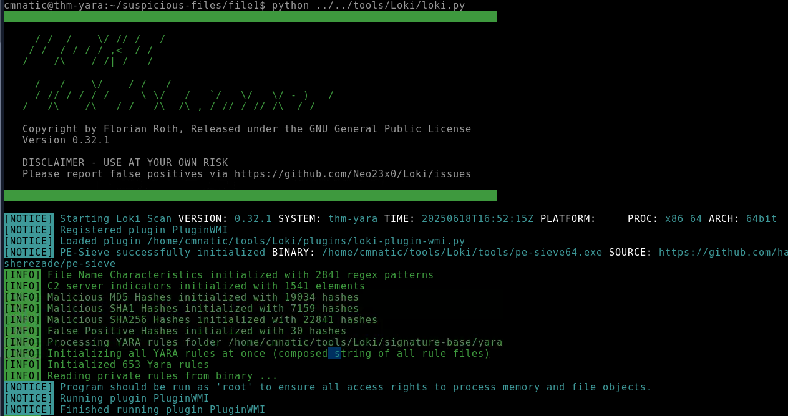

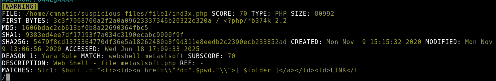

We received a warning flag! Making our suspicions true, that Loki has flagged a file as **Suspicious**.

*Q2: What Yara rule did it match on?*

A: Looking at the MATCH line, we see that the yara rule Loki matched on is **webshell metaslsoft**.

*Q3: What does Loki classify this file as?*

A: Loki classified the file as a **Web Shell**. This is seen on the DESCRIPTION line.

*Q4: Based on the output, what string within the Yara rule did it match on?*

A: The output indicates that the yara rule matched on the **First String**, which is declared as str1.

*Q5: What is the name and version of this hack tool?*

A: Seen on the FIRST BYTES line, the name and version of the hack tool is **b374k version 2.2**.

*Q6: Inspect the actual Yara file that flagged file 1. Within this rule, how many strings are there to flag this file?*

A: There is **1** string in this Yara rule file.

*Q7: Scan file 2. Does Loki detect this file as suspicious/malicious or benign?*

A: After scanning the file, there are no warnings. The results state the system is clean.

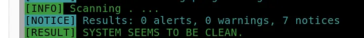

*Q8: Inspect file 2. What is the name and version of this web shell?*

A: Let's inspect the file. `nano 1ndex.php`.

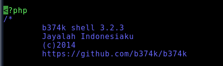

We have our answer! It is **b374k 3.2.3**.

**Creating Yara Rules with YarGen**

*Q1: From within the root of the suspicious files directory, what command would you run to test Yara and your Yara rule against file 2?*

First, we need to navigate to YarGen. This is done via the following: `cd /tools/yaraGen`. Next we input the following: `python3 yarGen.py -m /home/cmnatic/suspicious-files/file2 --excludegood -o /home/cmnatic/suspicious-files/file2.yar`.
This will create our rule.

A: Assuming you created the rule as seen above, we can proceed to test Yara and our new Yara rule against file2. This is done by the following command:
 **`yara file2.yar file2/1ndex.php`.

*Q2: Did Yara rule flag file 2? (Yay/Nay)*

A: **Yes**, the Yara rule flagged file 2.

*Q3: Copy the Yara rule you created into the Loki signatures directory.*

A: **No Answer Needed**

*Q4: Test the Yara rule with Loki, does it flag file 2? (Yay/Nay)*

A: **Yes**, Loki does flag file 2 with the Yara rule.

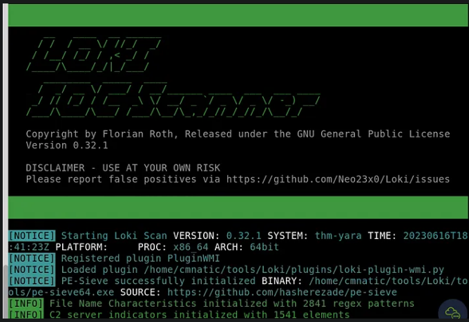

*Q5: What is the name of the variable for the string that it matched on?*

A: Upon running our Loki scan on the file2 with our new rule in place, we get a warning flag.

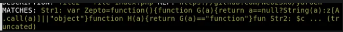

In the MATCHES section, we see the first string with a variable called **Zepto**.

*Q6: Inspect the Yara rule, how many strings were generated?*

A: We just need to simply nano our .yar file. This is done by inputting `nano file2.yar`.

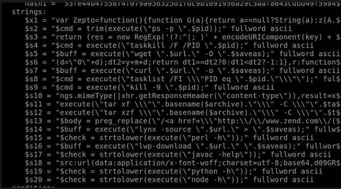

In the image above, we see **20 strings**. 

*Q7: One of the conditions to match on the Yara rule specifies file size. The file has to be less than what amount?*

A: At the bottom of the .yar file, we also seed the maximum file size. This size is **700 Kilobytes (KB)**.

**Task 10 - Valhalla**

*Q1: Enter the SHA256 hash of file 1 into Valhalla. Is this file attributed to an APT group? (Yay/Nay)*

A: Upon entering file1's SHA256 string into Valhalla, we get 7 total results. So, **Yes**, the file is attributed to an APT group.

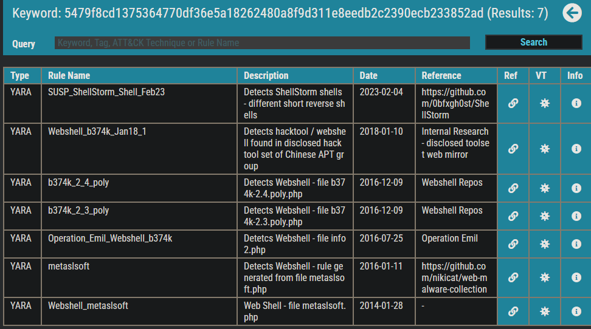

*Q2: Do the same for file 2. What is the name of the first Yara rule to detect file 2?*

A: After entering our SHA256 hash into Valhalla, we get 4 results:

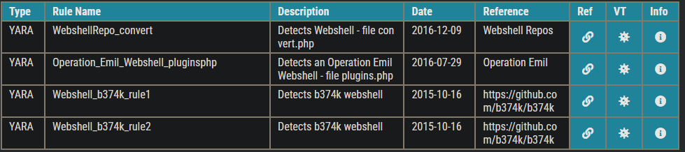

We can see the first rule is ***Webshell_b37rk_rule1***.

*Q3: Examine the information for file 2 from Virus Total (VT). The Yara Signature Match is from what scanner?*

A: We need to click the virus button which is in the **VT** column. This will take us to VirusTotal samples. It can be seen from the samples that **THOR APT Scanner** is the signature match.

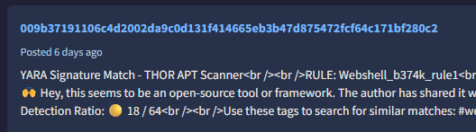

*Q4: Enter the SHA256 hash of file 2 into Virus Total. Did every AV detect this as malicious? (Yay/Nay)*

A: Upon entering the hash on Virustotal, we can see that **Not every AV** detected the trojan.

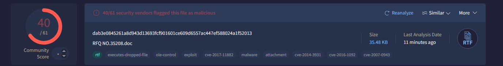

*Q5: Besides .PHP, what other extension is recorded for this file?*

A: the **EXE** extension is recorded on record for this file in VirusTotal, under the "Details" section.

*Q6: What JavaScript library is used by file 2?*

A: Click the link button in Valhalla. The GitHub reference page says that file2 uses the **Zepto** JavaScript library.

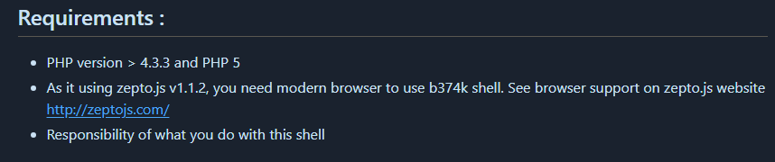

*Q7: Is this Yara rule in the default Yara file Loki uses to detect these type of hack tools? (Yay/Nay)*

A: **No**, this Yara rule is not in the default Yara file Loki uses for detection.

**Thanks for Reading!**
